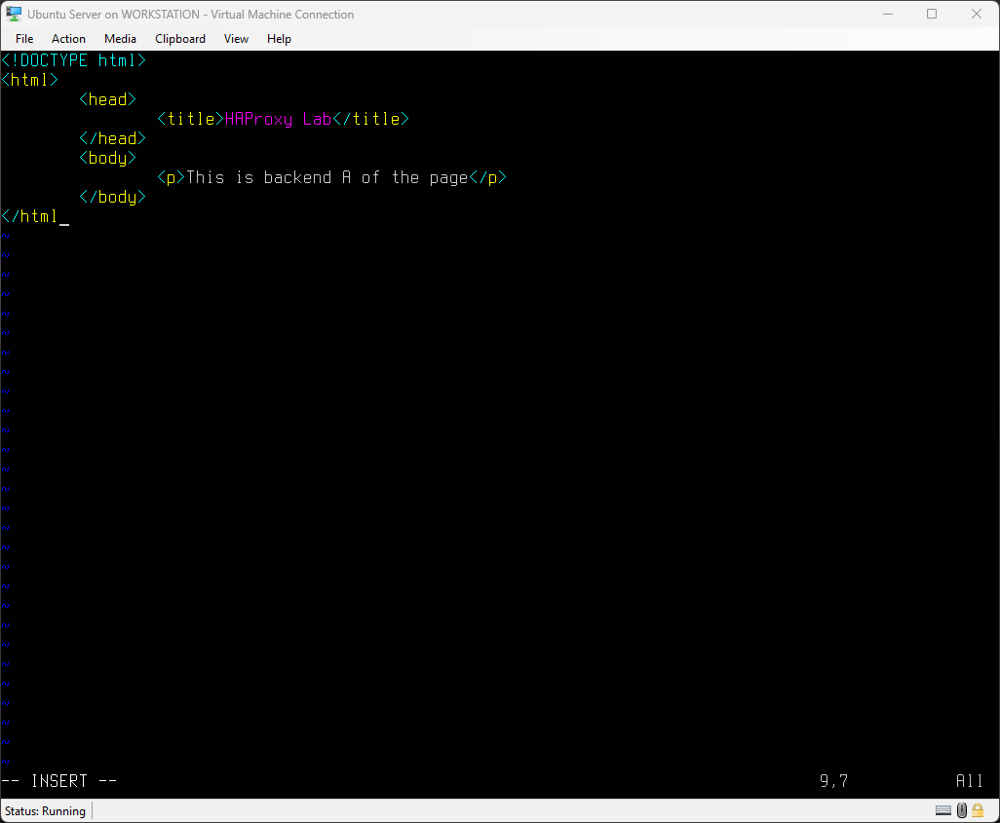
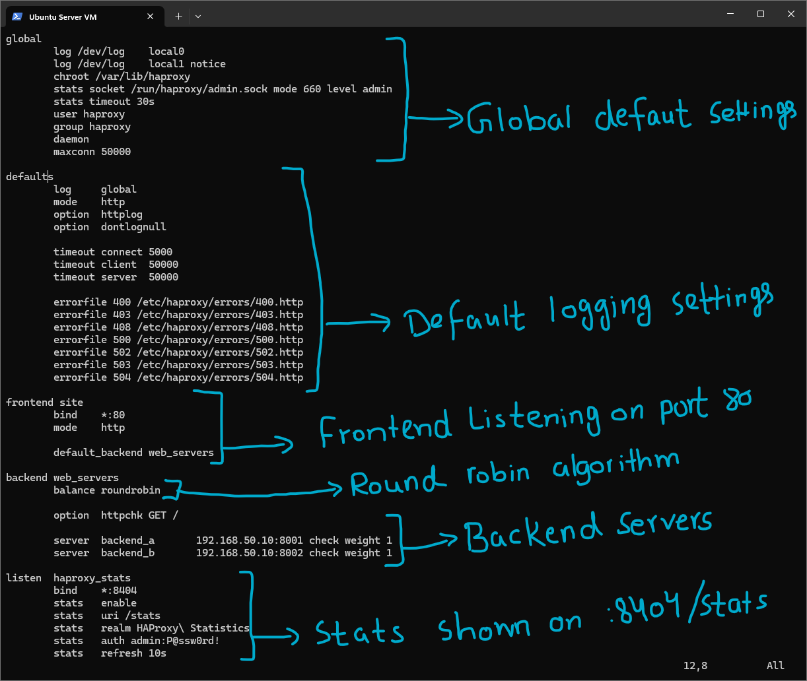
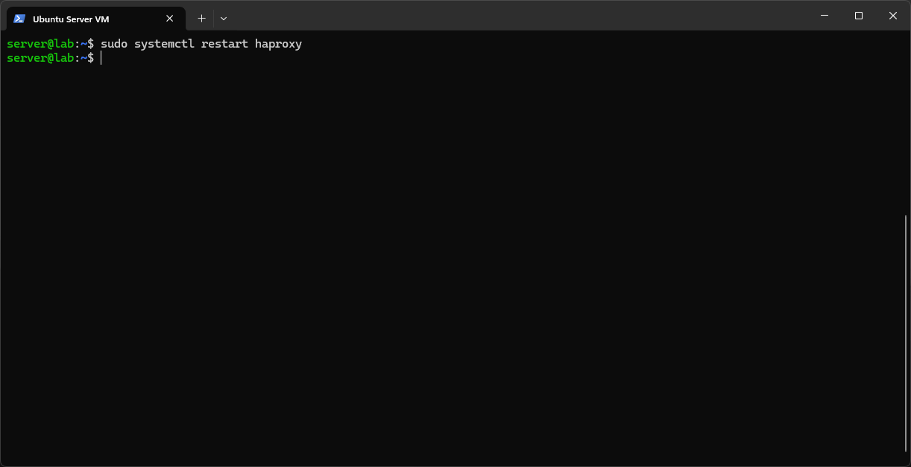
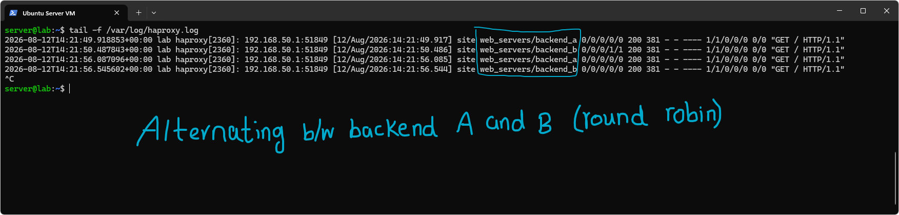
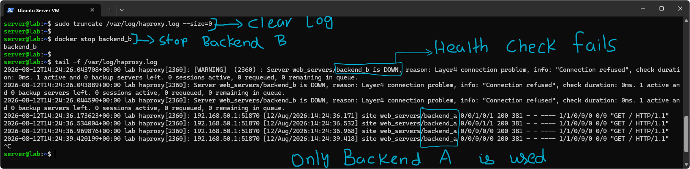
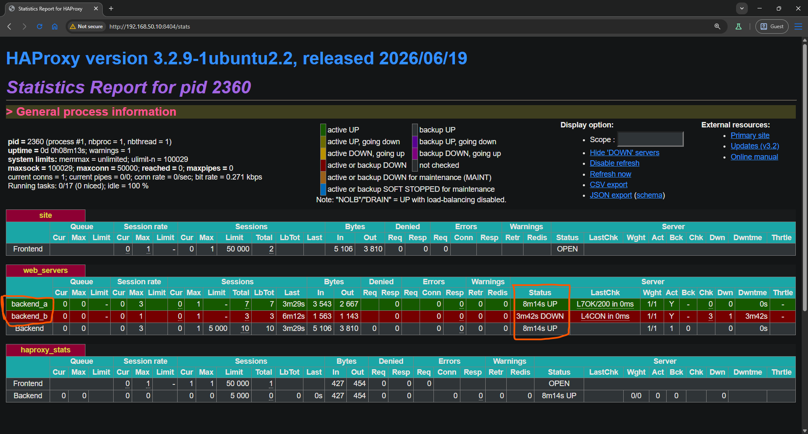
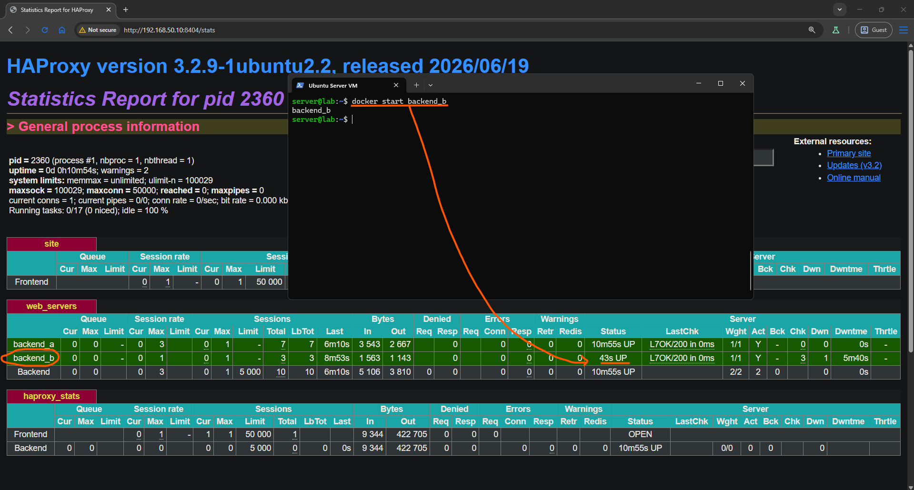
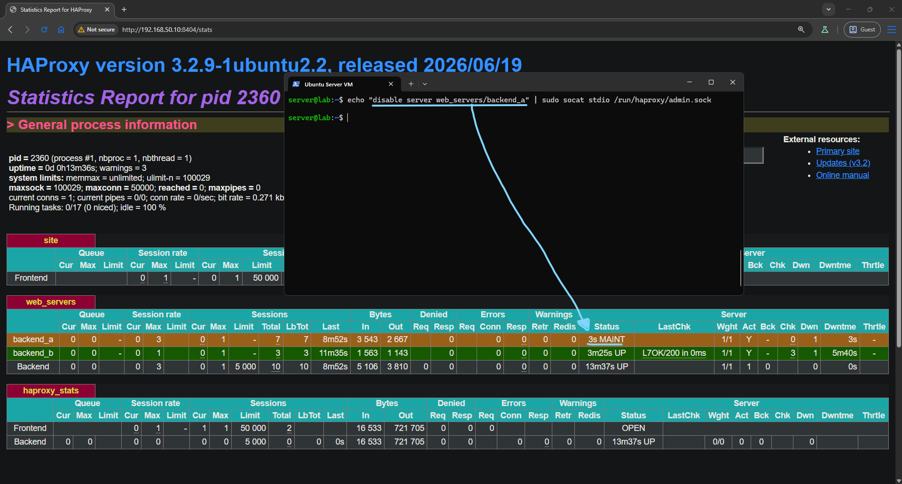
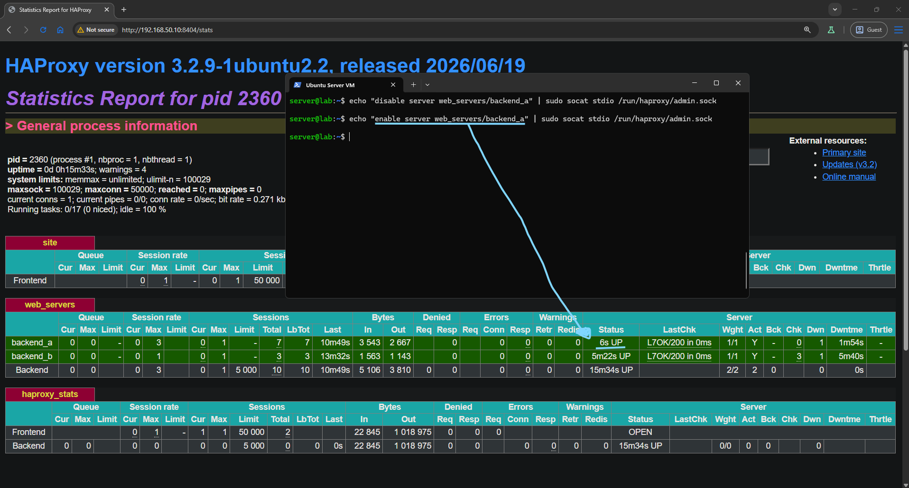

# HAProxy

HAProxy is what is used at scale. It handles millions of connections per second, has a richer health check system, better stats, and more fine-grained routing than nginx. It is the standard for production TCP and HTTP load balancing.

This lab was performed on a single Ubuntu Server VM. This was done because the main focus of this lab was to understand how HAProxy works. The working of load balancing through a reverse proxy was explored earlier, as was the accessibility of using a remote backend alongside a local one. So for this lab, I wanted to understand the advanced enterprise features of HAProxy, and I chose a simpler setup deliberately.

## Setup and Config

I wrote a simple `index.html` designed to display the backend being used to serve the page, as in the previous lab, so I would have a clear indication of which backend was being used. This was put into two separate Docker containers named `backend_a` and `backend_b`, also as in the previous lab.

This was the end result, two individual servers running inside two Docker apache2 containers, with one serving on port 8001 and the other on 8002.

Then I got to setting up HAProxy.

---

I installed HAProxy through `sudo apt install haproxy -y` and got to editing the config file located at `/etc/haproxy/haproxy.cfg`.

These were the settings I chose. The `global` and `defaults` blocks were left unchanged from their default configuration.

I defined a `frontend` block which listens on port 80 of the host for HTTP requests and uses the default backend named `web_servers`.

I then defined the `web_servers` backend and specified the balance algorithm as round robin, as in the nginx lab. The purpose of this lab was not to compare algorithms but to explore the features of HAProxy. I also enabled health checks using an HTTP GET request by specifying `option httpchk GET /`.

Finally, I defined the backend servers that would be used and gave them equal weights. That completed the `backend` block.

I also added a listener bound to port 8404, which reports HAProxy statistics, the main enterprise-level feature HAProxy provides. I set up simple auth by specifying a username and password. It is exposed here since this was all done locally. The stats are reported at the URL `192.168.50.10:8404/stats`.

---

With the config written, I restarted the HAProxy service with `sudo systemctl restart haproxy` so the new configuration would actually be loaded. Editing `haproxy.cfg` on its own has no effect until the service picks up the change, this is the same behavior as nginx needing a reload after a config edit, and it is a step worth remembering since a config that never gets applied looks identical to a config that is wrong.

I confirmed that the proxy was indeed working as a round robin load balancer by going to the IP address `192.168.50.10` and refreshing. It showed different backends upon each refresh.

Following the log file for HAProxy at `/var/log/haproxy.log`, I could see that it was indeed alternating between the different backends on each request.

## HAProxy Health Check and Failover

HAProxy polls each backend with health checks. When a backend fails its checks, HAProxy automatically removes it from the pool. Traffic reroutes with zero manual intervention.

To test the failover scenario and health checks, I cleared the previous HAProxy log and stopped `backend_b` by stopping the Docker container running that server, via `docker stop backend_b`.

When I viewed the log file with `tail -f /var/log/haproxy.log`, it confirmed that HAProxy's health checks had detected `backend_b` was down and removed it from the pool automatically. The subsequent requests were served entirely by the only available backend, `backend_a`.

One detail worth noting here: even though I had configured `option httpchk GET /`, which performs an application layer (Layer 7) check, the log reported the failure as a Layer 4 connection problem. This is because HAProxy has to establish a TCP connection to the backend before it can even attempt the HTTP level check. Since the container was completely stopped, there was nothing listening on the port at all, so the failure happened at the connection stage, before HAProxy ever got the chance to send the GET request. Once a backend is actually reachable and passing checks, the stats page reports it as `L7OK`, confirming the HTTP level check is what runs under normal conditions.

I visited the HAProxy stats page at `192.168.50.10:8404/stats`, as configured in the config file, and it asked for the credentials I had set up. Upon logging in, it showed the stats in a GUI interface. Immediately I could see that `backend_b` was DOWN, since I had previously stopped the container serving it.

Upon starting the Docker container again with `docker start backend_b`, the result was immediately updated on the HAProxy stats page, and `backend_b` showed as UP, meaning it was automatically added back to the pool as soon as the health check determined it was up.

HAProxy can also take arguments through its statistics socket, which is the optimal way of bringing backends up or down manually. I disabled `backend_a` using the socket file, and on the stats page it showed up as being under maintenance, which is the enterprise way of doing this.

I finally re-enabled the server using the same argument as before, but with the `enable` directive, and it was promptly brought back up.

## Summary

> **HAProxy vs nginx for load balancing**: nginx is a web server that also does load balancing. HAProxy is a pure load balancer and proxy, it does nothing else. At scale, HAProxy typically performs better and gives more control over health checks, timeouts, and ACLs. Both are valid choices.

I used nginx on my actual VPS because the scope of my cloud network does not require enterprise solutions yet. I might move my lab site to be balanced through HAProxy in the future, though.
