# iptables: Theory and Practical Lab

iptables kept coming up while configuring services on the VPS, and it was hard to
reason about without understanding what was actually happening underneath. This led
to a multi-day deep dive into iptables fundamentals, since the idea of inspecting and
acting on individual packet fields (TCP flags, source/destination, protocol, and so
on) felt worth understanding properly rather than copy-pasting rules.

## Introduction

iptables is a general-purpose packet filtering and manipulation tool that configures
**netfilter**, the packet filtering framework built into the Linux kernel. Because it
sits directly in the kernel's network stack, it can inspect, accept, drop, modify, or
forward nearly any packet that touches a network interface on the system.

## Fundamentals

### netfilter

netfilter is Linux's firewall engine, living in kernel space. It is responsible for:

- Packet filtering (DROP / ACCEPT)
- Network and port address translation (NAT/PAT)
- Port forwarding
- Packet header modification
- Stateful packet inspection (tracking connection state, not just individual packets)

iptables itself runs in user space and is just the configuration interface to
netfilter. Most people say "iptables" to refer to the whole system, but it helps to
separate the two conceptually: iptables is the steering wheel, netfilter is the
engine.

```

      USER SPACE
┌─────────────────────┐ 
│ iptables command    │ ← rules typed here 
└─────────┬───────────┘ 
          │ configures 
          ▼ 
     KERNEL SPACE 
┌────────────────────┐ 
│ netfilter          │ ← actually inspects packets 
└────────────────────┘

```

When a packet arrives, netfilter tracks it as part of a connection flow and checks it
against the rules in whichever chain it traverses, based on the packet's direction
and purpose.

### Tables and Chains

netfilter organizes rules into tables, and each table contains chains that correspond
to different points in a packet's journey through the system.

```

Incoming traffic -> filter table, INPUT chain Outgoing traffic -> filter table, OUTPUT chain Routed/forwarded traffic -> filter table, FORWARD chain SNAT / masquerading -> nat table, POSTROUTING chain Port forwarding (DNAT) -> nat table, PREROUTING chain TTL/TOS modification -> mangle table, various chains Skipping conn-tracking -> raw table, PREROUTING chain

````

The `filter` table is the default and the one used throughout this lab.

### Rules and Targets

A rule is a match condition paired with an action. Rules inside a chain are evaluated
top to bottom, and order changes behavior significantly.

```bash
iptables -t filter -A INPUT -p tcp --dport 22 -s 192.168.1.100 -j ACCEPT
````

|Part|Meaning|
|---|---|
|`-t filter`|Table (omitted defaults to filter)|
|`-A INPUT`|Append rule to the INPUT chain|
|`-p tcp`|Match TCP protocol|
|`--dport 22`|Match destination port 22|
|`-s 192.168.1.100`|Match source IP|
|`-j ACCEPT`|Target: accept the packet|

Targets fall into two categories:

|Target|Type|Effect|
|---|---|---|
|`ACCEPT`|Terminating|Packet accepted, no further rules checked|
|`DROP`|Terminating|Packet silently discarded, sender gets no response|
|`REJECT`|Terminating|Packet dropped, sender gets an explicit error reply|
|`LOG`|Non-terminating|Logs the packet header, then continues evaluation|
|`RETURN`|Non-terminating|Stops traversing the current chain, returns to caller|

### Default Policy

If a packet reaches the end of a chain without matching any rule, the chain's default policy decides its fate. This is either `ACCEPT` (the out-of-the-box default) or `DROP`.

Since rules are evaluated top to bottom and the first matching terminating target wins, an ACCEPT rule placed above a DROP rule for the same traffic means the DROP rule is effectively dead code. Rule order has to be planned deliberately, especially in scripts that build a ruleset from scratch.

---

## Lab Setup

To safely experiment with a tool this powerful, a dedicated Ubuntu Server VM was set up in Hyper-V rather than testing directly on the production VPS. The VM has two network interfaces (one for internet access, one static IP on an internal switch for SSH), an SSH server, and Apache2 installed to provide something to filter against.

A static IP was configured using `netplan`, and the VM was accessed from the Windows host using the Bitvise SSH client.

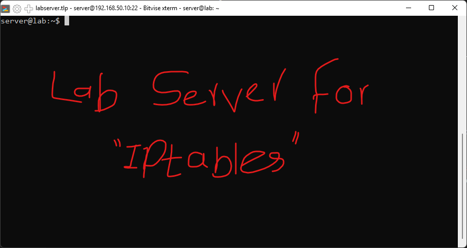

```bash
sudo iptables -vnL
```

This lists the full ruleset for every chain in the `filter` table. Initially, all three default chains (INPUT, FORWARD, OUTPUT) show a policy of `ACCEPT` with no rules, meaning no filtering is happening at all yet.

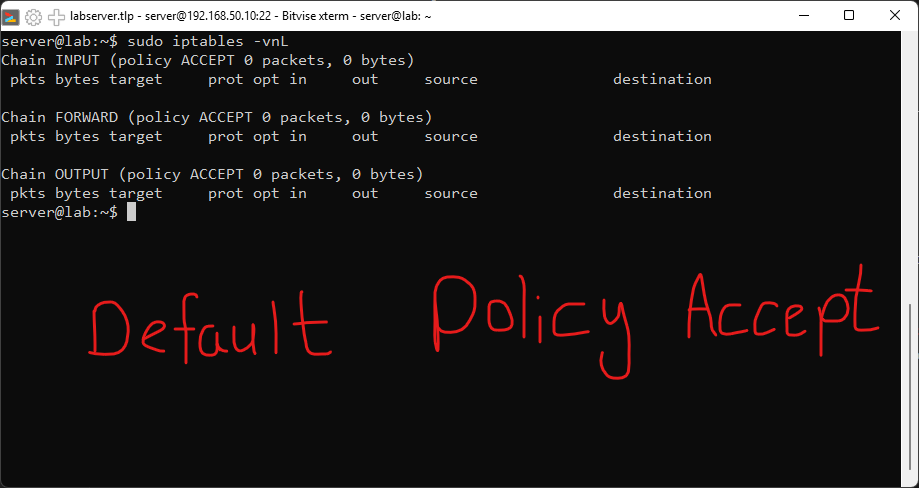

```powershell
ipconfig | select-string -Context 6 "Ubuntu-LAN"
```

This was run on the Windows host to find the IP address Hyper-V assigned to the virtual switch connecting to the Ubuntu VM. Knowing this address is necessary to write a rule that allows SSH only from the Windows host specifically.

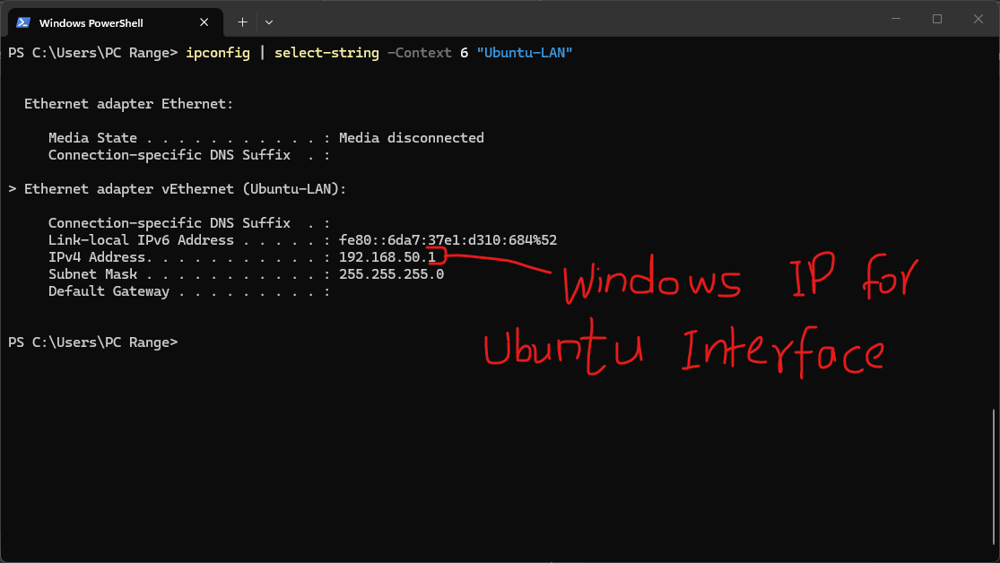

Apache2 was already running on the VM as a target for HTTP/S filtering tests. The default Apache page loads correctly from the Windows host browser at this point, confirming baseline connectivity before any filtering rules are applied.

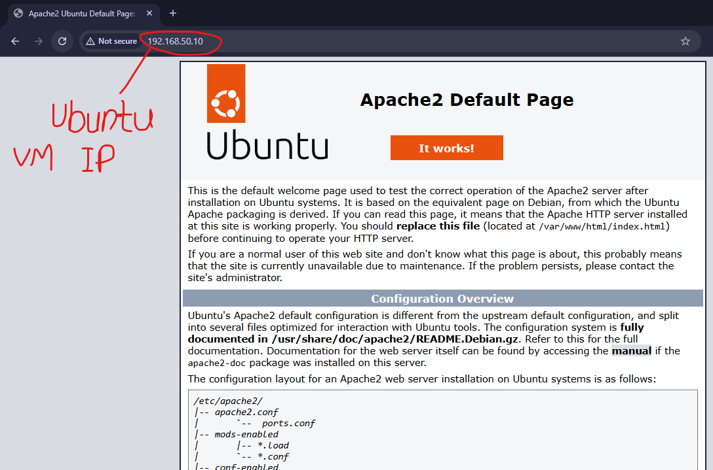

---

## Building Rules Interactively

```bash
sudo iptables -A INPUT -p tcp --dport 22 -s 192.168.50.1 -j ACCEPT
sudo iptables -A INPUT -p tcp --dport 22 -j DROP
```

The first rule explicitly accepts SSH traffic from the Windows host's IP. The second rule drops all other SSH traffic on port 22, with no response sent back to the sender.

Running the DROP rule did not break the existing SSH session. This confirms rule ordering is working as expected: since the ACCEPT rule for the Windows IP comes first and is a terminating target, matching packets never reach the DROP rule below it.

`sudo iptables -vnL` afterward shows the ACCEPT rule's packet counter increasing, confirming Windows traffic is matching that rule specifically.

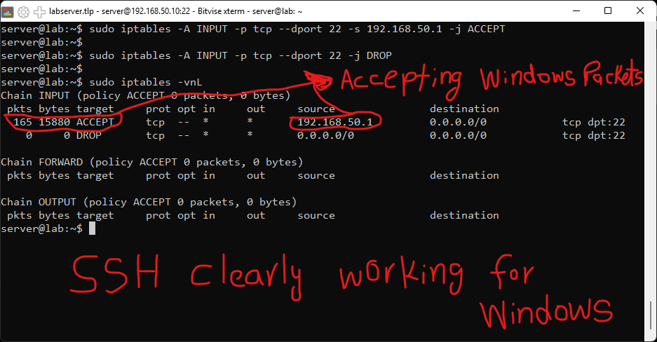

```bash
sudo iptables -D INPUT 2
```

This deletes rule number 2 in the INPUT chain (the DROP rule). A rule's numeric position can be checked with `iptables -vnL --line-numbers`. After deletion, only the ACCEPT rule remains.

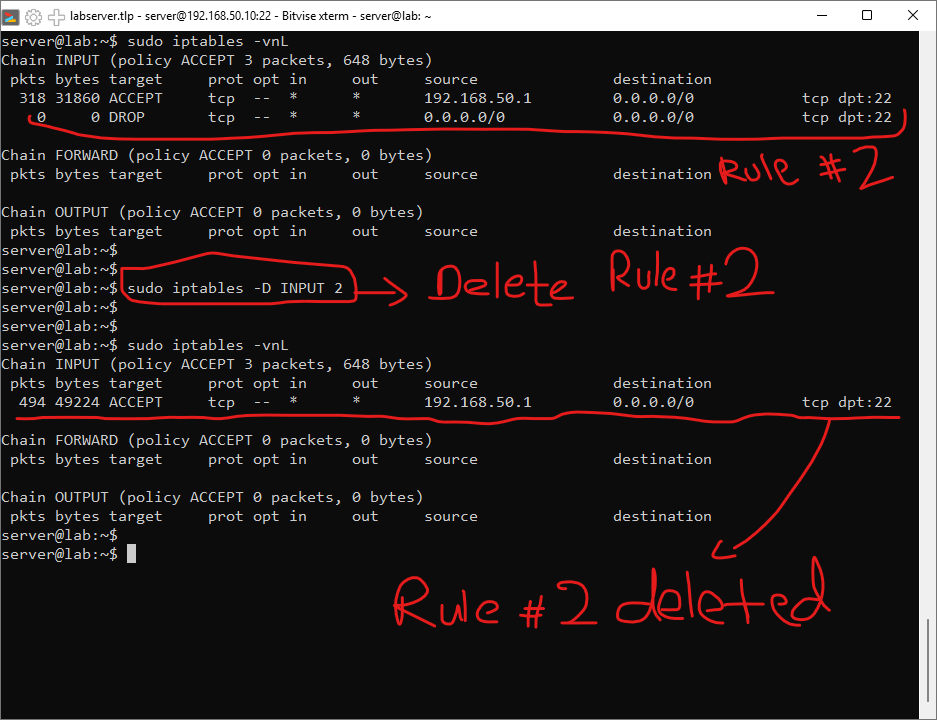

```bash
sudo iptables -P INPUT DROP
```

This sets the INPUT chain's default policy to DROP. Existing SSH connectivity from the Windows host is unaffected because there is still an explicit ACCEPT rule for that source IP, evaluated before the default policy is ever reached. At this point the DROP counter is still zero, since no traffic has yet fallen through to the default policy.

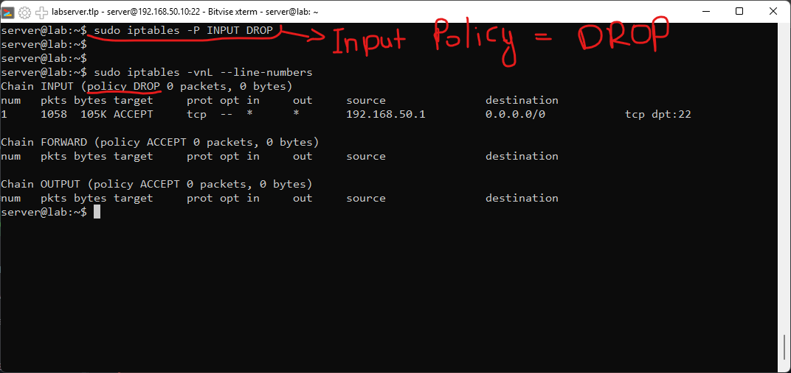

With the default policy now DROP, the Apache2 page no longer loads, since there is no rule explicitly allowing HTTP traffic.

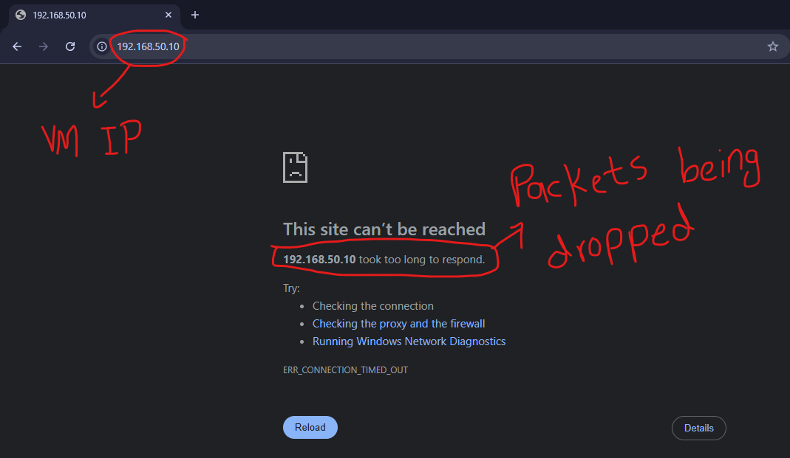

Checking `iptables -vnL` again shows the DROP policy counter incrementing: 99 packets and 7440 bytes dropped, corresponding to the browser's repeated connection attempts that received no response.

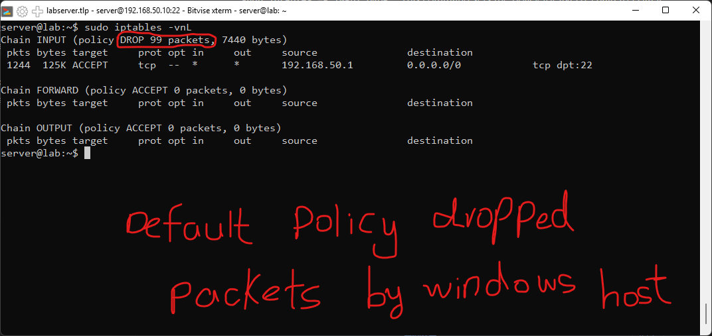

```bash
sudo iptables -A INPUT -p tcp -m multiport --dports 80,443 -j ACCEPT
```

This adds a rule allowing inbound TCP traffic to ports 80 and 443 from any source, using the `multiport` module to match multiple ports in a single rule rather than writing two separate rules.

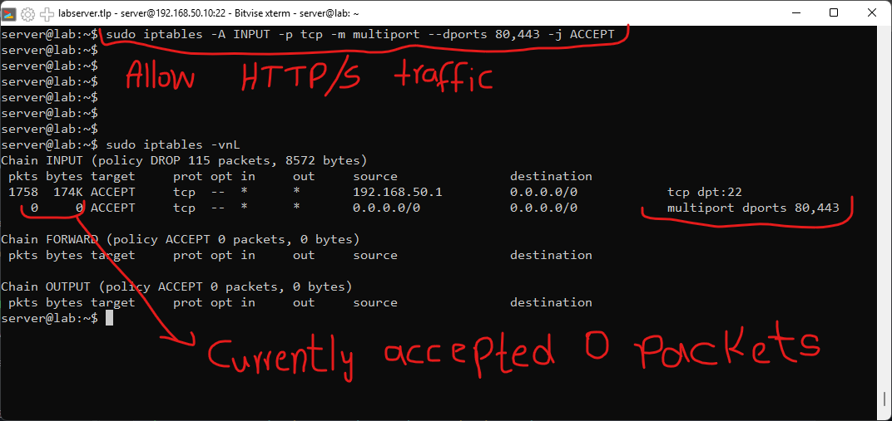

Reloading the Apache2 page in the browser now succeeds, confirming the new rule is working.

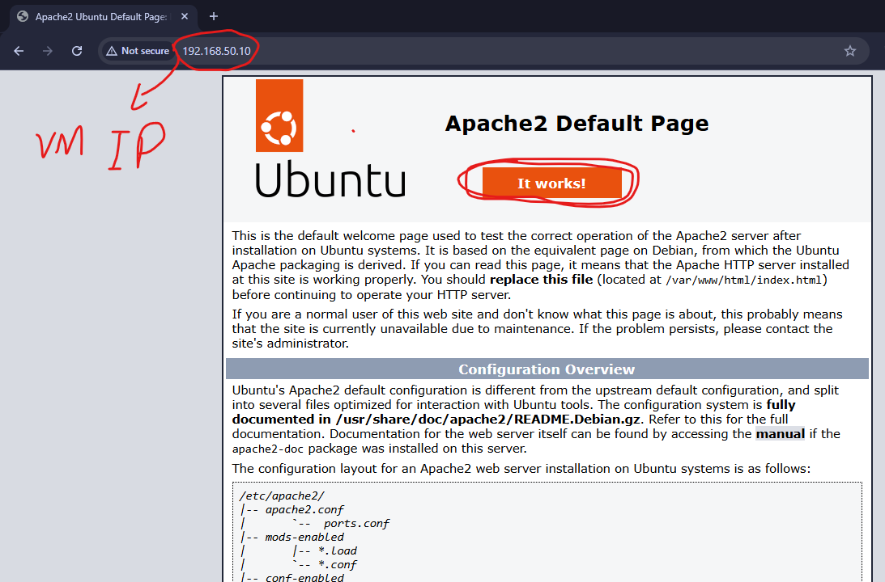

```bash
sudo iptables -vnL INPUT
```

This confirms the multiport rule has accepted 15 packets, proving HTTP/S traffic is allowed while everything else remains blocked by the default DROP policy.

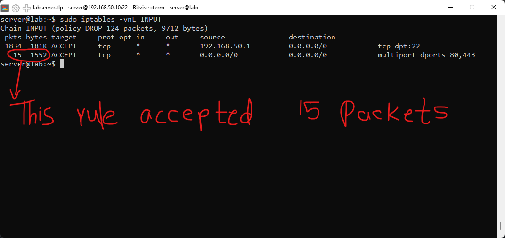

As a final check, an ICMP ping was sent from the Windows host to the VM. The ping timed out completely, confirming that only the explicitly allowed traffic (SSH from the trusted IP, and HTTP/S from anywhere) passes through, while everything else, including ICMP, is silently dropped.

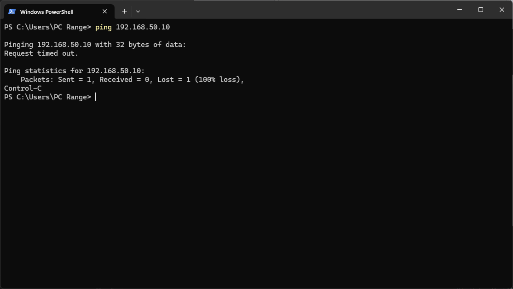

---

## Applying This Back on the VPS

While working through this lab, it became clear that the HTTP and HTTPS ACCEPT rules on the production VPS had been added separately and ended up far apart in the ruleset (rule index 1 and rule index 8). Using the `multiport` module learned here, both rules were deleted and re-added as a single clean rule.

```bash
sudo iptables -D INPUT 1
sudo iptables -D INPUT 8
sudo iptables -I INPUT 1 -p tcp -m multiport --dports 80,443 -j ACCEPT
```

The result is a single rule at index 1 handling both ports, instead of two scattered rules.

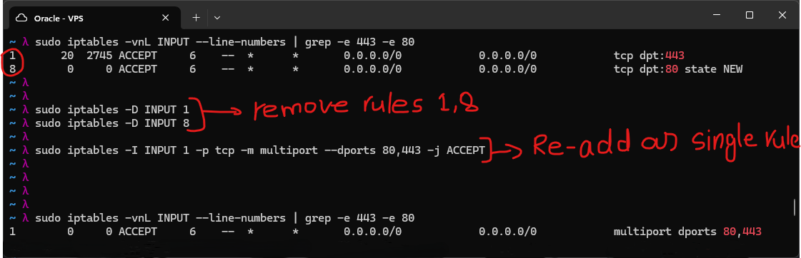

---

## Conclusion

iptables can filter on far more than what was covered hands-on here: source/destination IP, port, protocol, network interface, and even MAC address, among other match criteria. Three days were spent on this exploration, and a production-style firewall script was written to consolidate the concepts learned into something reusable.

```bash
#!/bin/bash
# firewall.sh — Production firewall script

# RESET
iptables -P INPUT   ACCEPT    # reset policies before flush
iptables -P OUTPUT  ACCEPT
iptables -P FORWARD ACCEPT
iptables -F                   # flush filter table
iptables -t nat    -F         # flush nat table
iptables -t mangle -F
iptables -X                   # delete user-defined chains

# POLICY
iptables -P INPUT  DROP
iptables -P OUTPUT DROP

# TRUSTED PORTS (configure here)
ALLOWED_PORTS="22 80 443"
MGMT_IP="192.168.50.1"

# RULES

# Loopback
iptables -A INPUT  -i lo -j ACCEPT
iptables -A OUTPUT -o lo -j ACCEPT

# Drop invalid packets
iptables -A INPUT  -m state --state INVALID -j DROP
iptables -A OUTPUT -m state --state INVALID -j DROP

# Allow management SSH from trusted IP only
iptables -A INPUT -p tcp --dport 22 -m state --state NEW -s $MGMT_IP -j ACCEPT

# Allow return traffic for established connections
iptables -A INPUT  -m state --state ESTABLISHED,RELATED -j ACCEPT
iptables -A OUTPUT -m state --state NEW,ESTABLISHED,RELATED -j ACCEPT

# Allow ICMP
iptables -A INPUT  -p icmp -j ACCEPT
iptables -A OUTPUT -p icmp -j ACCEPT

# Allow configured services
for PORT in $ALLOWED_PORTS; do
  iptables -A INPUT -p tcp --dport $PORT -j ACCEPT
done

echo "Firewall loaded."
iptables -vnL
```

This script resets all tables to a clean slate, sets a default-deny policy on both INPUT and OUTPUT, and then explicitly allows only loopback traffic, established connections, ICMP, management SSH from a single trusted IP, and a configurable list of service ports. This is a deny-by-default model, which is generally the safer approach for any internet-facing server compared to allowing everything and trying to block known-bad traffic after the fact.

