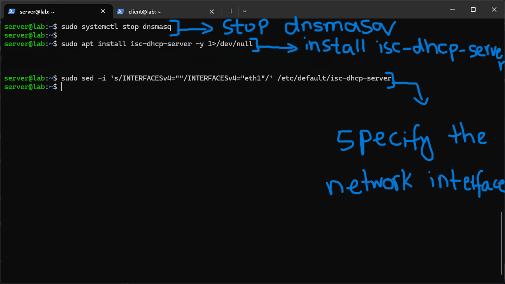
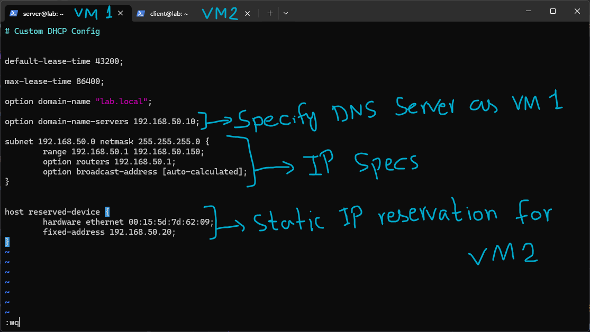
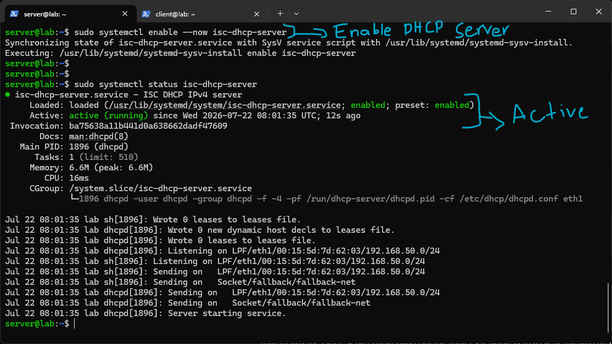
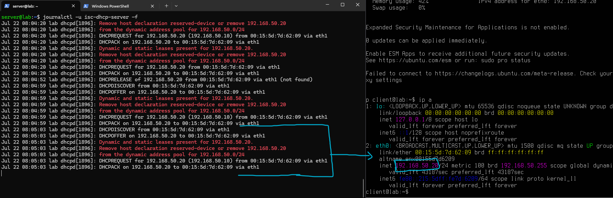
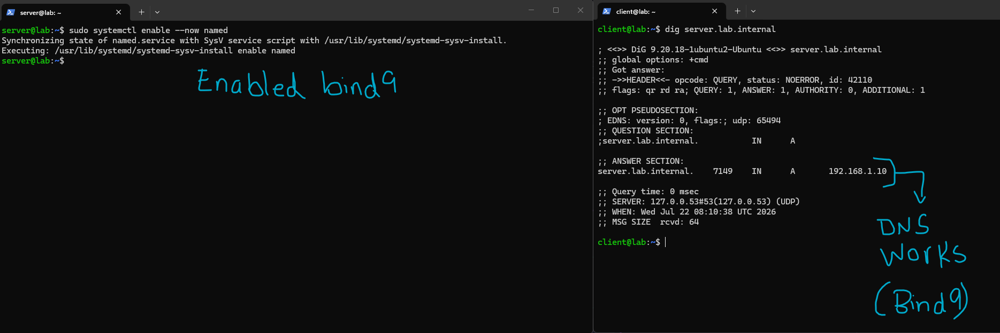
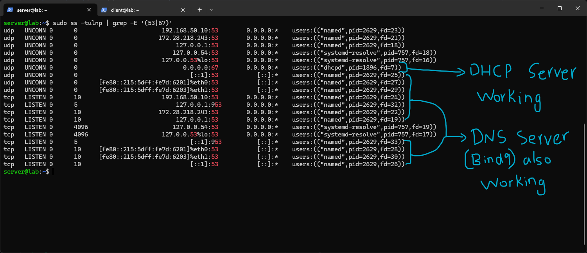
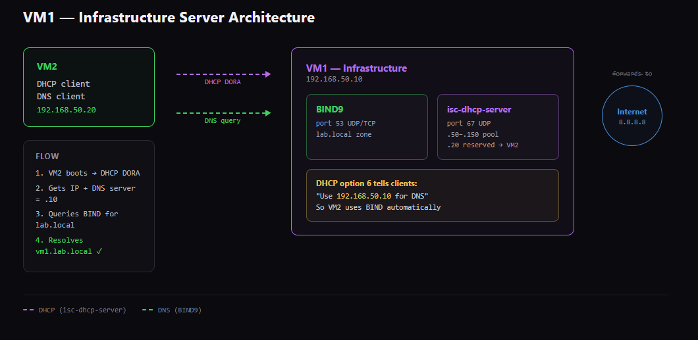

# isc-dhcp-server

For this lab I started by disabling dnsmasq, since running two separate DHCP servers on the same network at once would cause conflicting offers to clients, only one DHCP server should ever be authoritative for a given subnet at a time.



I installed isc-dhcp-server and pointed it at the correct interface with:

```

sudo apt install isc-dhcp-server -y sudo sed -i 's/INTERFACESv4=""/INTERFACESv4="eth1"/' /etc/default/isc-dhcp-server

```

This step doesn't exist in dnsmasq's config, dnsmasq handled interface binding directly inside `dnsmasq.conf` with the `interface=` line. isc-dhcp-server instead needs to be told which interface to listen on through a separate defaults file, which was a good reminder that different tools split up the same responsibility (which interface to bind DHCP to) in different places, and I had to actually go look for where this one expected it.



I then wrote a custom config at `/etc/dhcp/dhcpd.conf`, carrying over the same logical settings I had used in dnsmasq:

- `default-lease-time 43200` and `max-lease-time 86400` set how long a lease lasts by default versus the longest a client can request, in seconds. This is the same idea as dnsmasq's `dhcp-range=...,24h` value, just expressed as two separate explicit settings instead of one combined option.
- `option domain-name "lab.local"` and `option domain-name-servers 192.168.50.10` set the search domain and DNS server that get handed to clients, matching dnsmasq's `dhcp-option=6` from before, just written with a more descriptive option name here instead of a raw option number.
- The `subnet` block defines the pool (`192.168.50.1` to `192.168.50.150`), the router/gateway option, and the broadcast address, which is left as `[auto-calculated]` rather than typed manually, since it can be derived directly from the subnet and netmask.
- The `host reserved-device` block reserves `192.168.50.20` for VM2's MAC address, the same static reservation I had set up under dnsmasq, just using isc-dhcp-server's own syntax for it. I kept this specific IP for VM2 on purpose, since it's convenient for SSH and matches what VM2 had both under dnsmasq and under the original manual netplan config, keeping the addressing scheme consistent across every DHCP tool I've tested rather than reassigning it each time.



I enabled the service and confirmed it was running:

```

sudo systemctl enable --now isc-dhcp-server sudo systemctl status isc-dhcp-server

```

The status output showed it actively listening on `eth1` for the `192.168.50.0/24` subnet, and the startup log lines confirmed it read the leases file and began sending on the correct interface.



To actually watch the DHCP handshake happen, I rebooted VM2 and followed the log live on VM1:

```

journalctl -u isc-dhcp-server -f

```

This showed the full DORA process (Discover, Offer, Request, Acknowledge) play out in real time: `DHCPDISCOVER` from VM2's MAC address, `DHCPOFFER` back with `192.168.50.20`, `DHCPREQUEST` confirming VM2 wants that offer, and `DHCPACK` finalizing the lease. I had read about the DORA sequence in passing before, but actually watching all four steps show up as separate log lines one after another made it click a lot more than the abbreviation on its own had. On VM2's side, checking `ip a` afterward confirmed it had picked up exactly `192.168.50.20`, the reserved address, rather than some other IP from the open pool.



Since isc-dhcp-server is DHCP only and provides no DNS resolution at all, I re-enabled BIND9 (`named`) to bring DNS back for the network:

```

sudo systemctl enable --now named

```

From VM2 I confirmed resolution was working again with:

```

dig server.lab.internal

```

which correctly returned `192.168.1.10`, the same `A` record from the earlier BIND9 zone file lab, confirming DNS was fully working again and being served through `127.0.0.53`, systemd-resolved's local stub, forwarding to BIND9.



Finally, I checked which processes were actually listening on the relevant ports:

```

sudo ss -tulnp | grep -E '(53|67)'

```

This showed `dhcpd` bound to UDP port 67 (the standard DHCP server port) and `named` bound to port 53 across multiple addresses, both TCP and UDP, IPv4 and IPv6. Seeing both processes clearly separated by port and by process name made the split between the two services concrete, isc-dhcp-server and BIND9 are now running side by side as two independent, specialized services, rather than the single combined dnsmasq process handling both jobs at once like in the previous lab.



This is the final architecture for VM1 once both services were running together, isc-dhcp-server handling the DHCP pool and static reservation, BIND9 handling the `lab.local` zone, and DHCP option 6 tying the two together automatically so VM2 never needs a manually configured DNS server, the same way it worked under dnsmasq, just now split across two dedicated services instead of one combined one.

# Summary

This lab swapped dnsmasq's combined DNS/DHCP setup for two separate, specialized services, isc-dhcp-server for DHCP and BIND9 for DNS, running side by side on the same VM. The main thing this made clear is the tradeoff from the earlier BIND9 vs dnsmasq comparison in practice: isc-dhcp-server gave more explicit, named DHCP options and a clearer separation of concerns than dnsmasq's flat config, but it required BIND9 running alongside it to provide any DNS at all, where dnsmasq had quietly handled both out of a single file. Watching the full DORA sequence in the logs, and then confirming both services with `ss` afterward, tied together everything from the earlier DHCP option lab (option 3, option 6) with the DNS record work from the BIND9 labs, seeing them work together as two independent, correctly cooperating services rather than one all-in-one tool.

