# Disk Partitioning

### BIOS Boot Partition

A tiny 1MB partition required when using GPT with a legacy BIOS (non-UEFI) system. It gives the GRUB bootloader a place to store its second stage. It does not have a filesystem, GRUB writes directly to it. On UEFI systems, use an EFI System Partition (ESP) instead.

### /boot, Boot Partition (ext4)

Contains the Linux kernel images, initramfs, and GRUB config. Kept separate so the root filesystem can be encrypted, use LVM, or use a filesystem that GRUB cannot read natively. Size: 512MB to 1GB is typical. Filesystem: ext4, always, since GRUB reads it at boot before anything else loads. Warning: kernel images accumulate here, clean with `sudo apt autoremove`.

### /, Root Filesystem (ext4 or XFS)

The main filesystem where the OS and all installed packages live. Everything that is not in a separate mount point lives here. Size: 20 to 50GB for a server, more if installing a lot of software. Filesystem: ext4 (stable, well tested, default on Ubuntu/Debian) or XFS (faster for large files, default on RHEL/CentOS). Tip: keeping / separate from /home means OS reinstalls do not wipe user data.

### /home, Home Directories (ext4)

Separate partition for user home directories. Separating it means: OS reinstalls do not affect user data, different quotas can be applied, and it can be mounted with `noexec` to prevent users running malicious binaries from home. Size depends on users and data. Can be a separate LVM logical volume for easy resizing.

### swap, Swap Space

Virtual memory overflow. When RAM fills, the kernel pages inactive memory here. Having swap prevents OOM (Out of Memory) kills at the cost of performance. Size: traditionally 1x to 2x RAM. On modern servers with lots of RAM, 4 to 8GB is usually sufficient. On VMs for labs, a 1 to 2GB swapfile is fine. Note: a swap partition is slightly faster than a swapfile because the kernel can skip filesystem overhead.

## GPT vs MBR

### MBR (Master Boot Record)

| Property | Value |
|----------|-------|
| Max disk size | 2TB |
| Max partitions | 4 primary (or 3 + 1 extended) |
| Backup | None, single point of failure |
| BIOS type | Legacy BIOS only |
| Use when | Old hardware, VMs for compatibility |
| fdisk default | Yes (use `-t dos`) |

### GPT (GUID Partition Table)

| Property | Value |
|----------|-------|
| Max disk size | 9.4ZB (effectively unlimited) |
| Max partitions | 128 (on Linux) |
| Backup | Header copied at start and end |
| BIOS type | UEFI (can work with BIOS via BIOS Boot partition) |
| Use when | New servers, disks over 2TB, modern systems |
| fdisk default | Yes on modern systems (use `-t gpt`) |

## VM Partitioning

This lab was performed on the Hyper-V Ubuntu Client VM. I added a 10GB virtual disk drive. I aimed to learn about partitioning by partitioning this newly added drive.

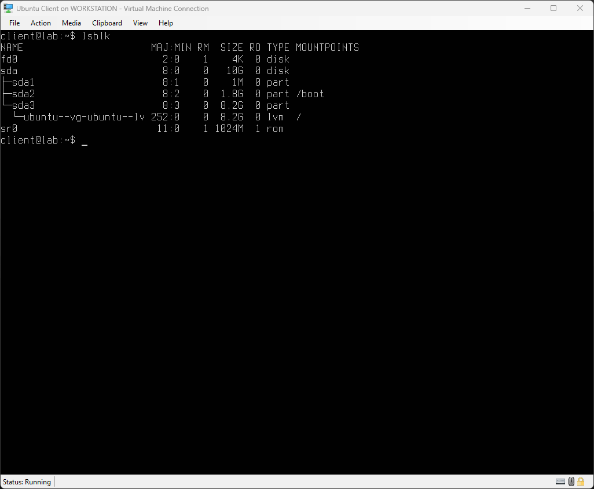

This was the structure of the filesystem before any additional disks were added. I checked it by running `lsblk`, which lists all block devices attached to the computer, or the VM in this case. Worth noting here: the existing disk, `sda`, has its root partition (`sda3`) managed through LVM, shown as `ubuntu--vg--ubuntu--lv` rather than as a plain partition. This is how the Ubuntu installer sets things up by default, root sits inside a logical volume rather than a raw partition, which gives more flexibility to resize later. The new disk I add in this lab is kept as plain partitions instead, to focus on the fundamentals of partitioning itself rather than LVM.

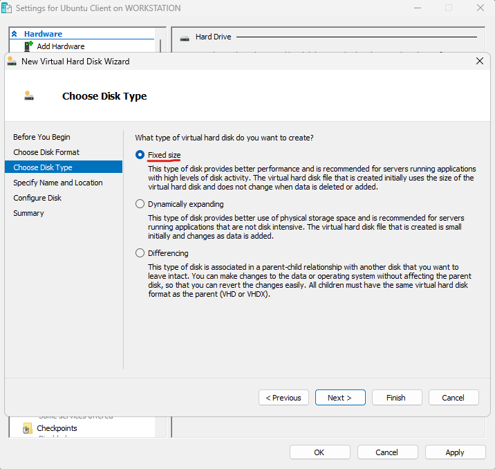

I proceeded to add a fixed size disk to the VM for easier partitioning.

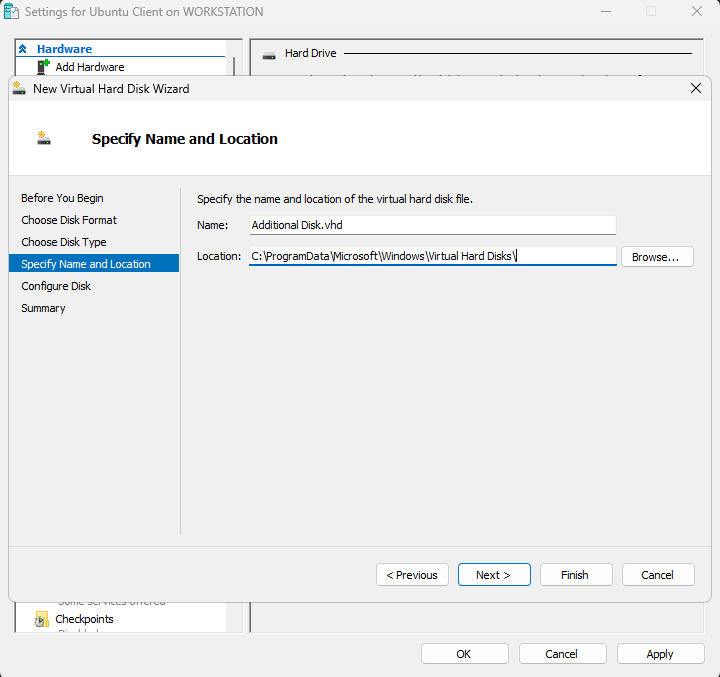

I kept the default name and location for the new virtual hard disk file.

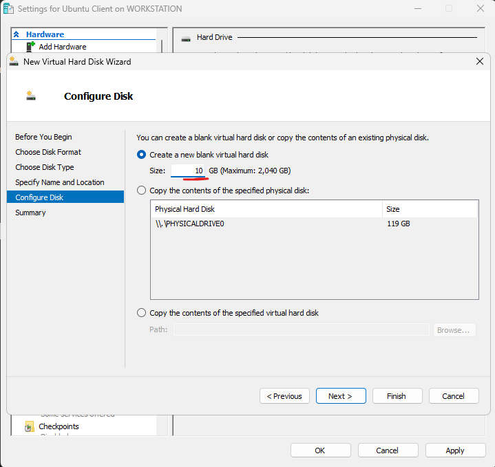

I gave it a size of 10GB. This is enough to demonstrate partitioning.

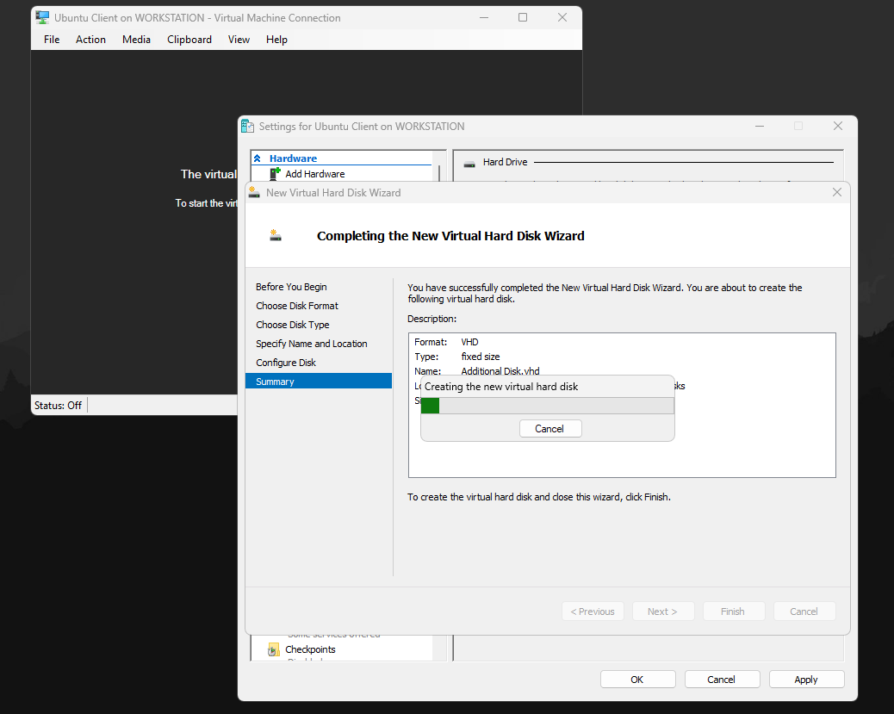

It took some time to create the disk, as it was a fixed size disk instead of a dynamic one.

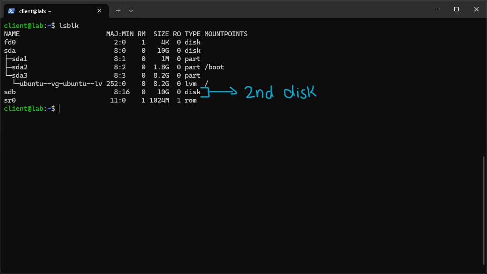

Upon starting the VM again and accessing it via SSH, the `lsblk` command returned a second disk this time. It was named `sdb`, with no partitions. This is how physical disks appear on Linux after being attached to the computer.

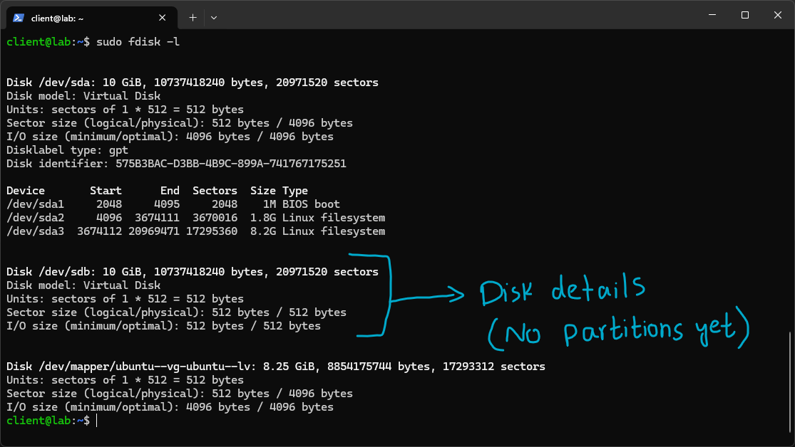

I ran `sudo fdisk -l` to see more detail about the disks. It showed the details for `/dev/sdb` and showed no partitions, since there were none at this point.

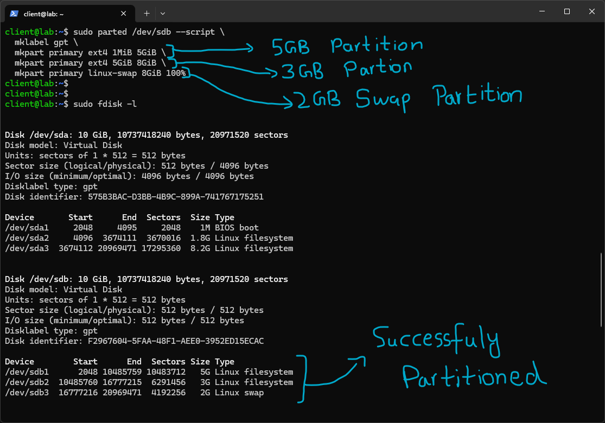

I chose to partition the disk with the `parted` command, since it accepts a `--script` flag and can be used to automate partitioning on production systems. Learning this is more useful than `fdisk`, which opens an interactive prompt where each disk has to be partitioned manually every time.

I chose the GPT partition table, since it is modern and standard, expressed by `mklabel gpt` in the parted command.

I created three partitions:

`mkpart primary ext4 1MiB 5GiB` is essentially saying to slice the disk starting from the 1MB point of the disk to the 5GB point. This creates a 5GB partition.

`mkpart primary ext4 5GiB 8GiB` is the same as before, but for the next sector going from the 5GB point to the 8GB point. This creates a 3GB partition (8 minus 5).

`mkpart primary linux-swap 8GiB 100%` specifies the next chunk, starting from the 8GB point to 100% of the remaining disk space. Given how much of the 10GB was left, this creates a 2GB swap compatible partition.

Running `fdisk -l` confirms that the disk has been partitioned. It contains no exact filesystems yet. Two partitions are of the Linux filesystem type, and the last one is of the Linux swap type. These need formatting before they are properly recognized as such.

---

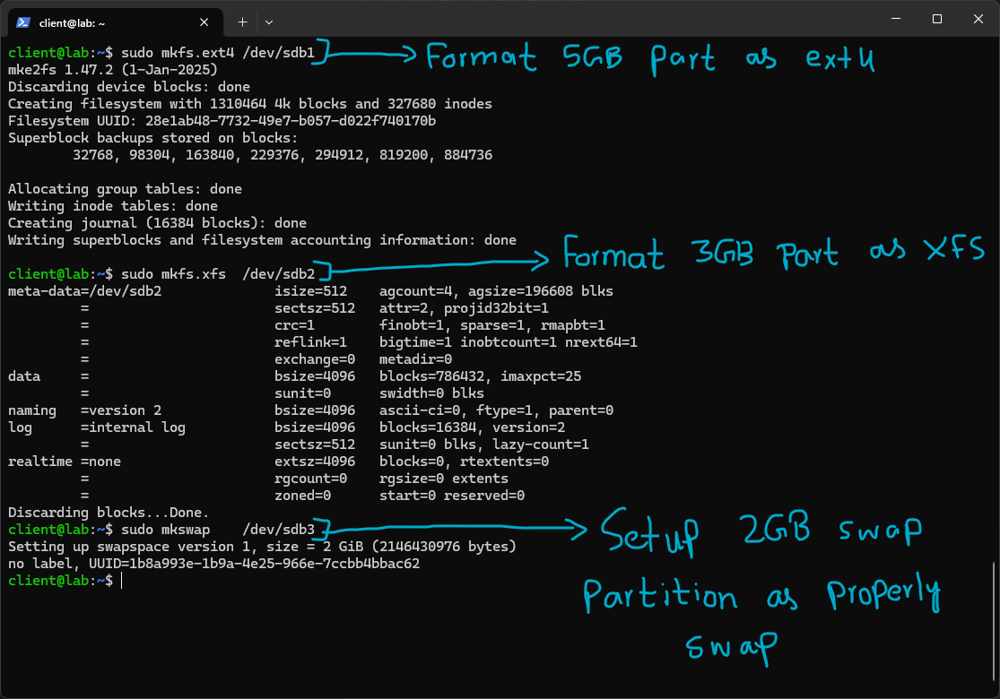

I formatted each of the newly created partitions using the `mkfs` utility.

`sudo mkfs.ext4 /dev/sdb1` formats the `sdb1` partition to the ext4 filesystem.

`sudo mkfs.xfs /dev/sdb2` formats the `sdb2` partition to the XFS filesystem.

`sudo mkswap /dev/sdb3` sets up swap properly on the `sdb3` partition, which was already intended to be used as a swap partition.

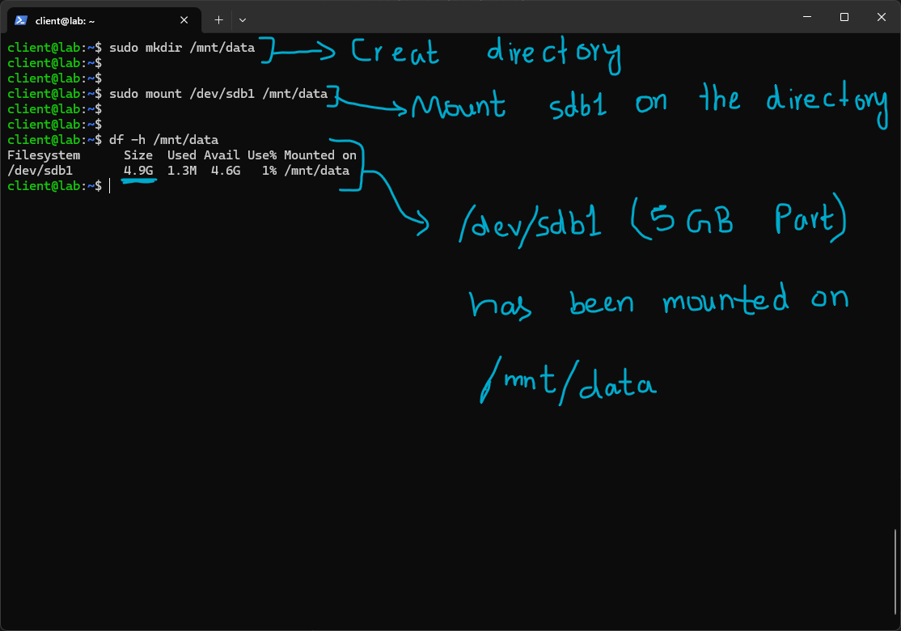

I created a directory, `/mnt/data`, and mounted the first partition, `sdb1`, on it. Using `df -h /mnt/data`, I confirmed that the partition `/dev/sdb1` was indeed mounted on it. The size also gives a hint as to which partition is mounted on this directory.

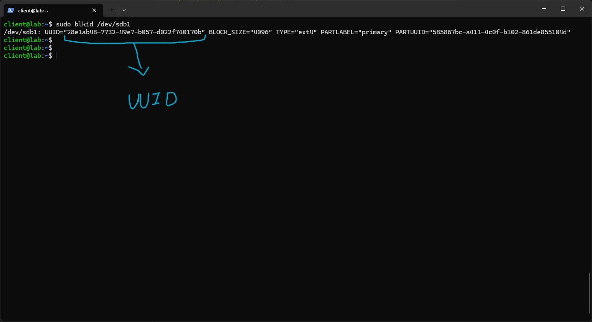

To make the changes permanent, I had to put the mount point in `/etc/fstab` so it would automatically mount on boot. For this, I noted down the UUID of the partition, since device names like `sdb1` can change on reboot, as they are arbitrarily assigned by Linux at boot. It is worth noting that `blkid` actually prints two different identifiers here: `UUID`, which identifies the filesystem itself and is what fstab should reference, and `PARTUUID`, which identifies the GPT partition table entry rather than the filesystem sitting inside it. Using the filesystem UUID means the entry keeps working even if the partition is reformatted with a different filesystem later.

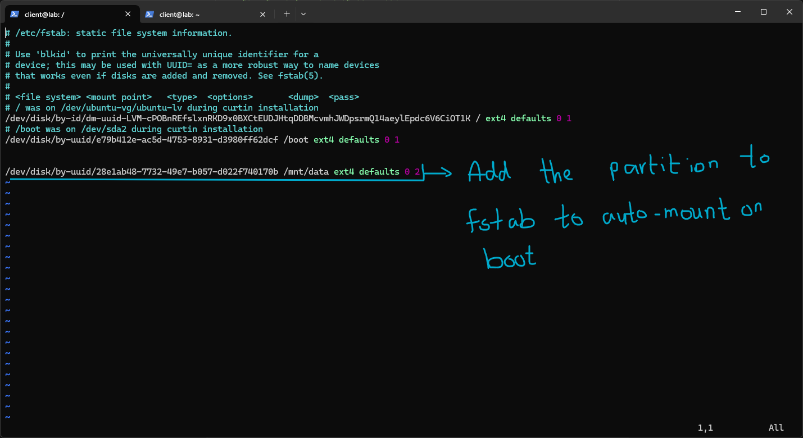

I put the entry for the latest partition, along with its mount point, using the UUID. This ensures that the partition automatically mounts the next time the system reboots. The two trailing numbers in the fstab line are the dump and pass fields. Dump controls whether the legacy `dump` backup utility should back up this filesystem, `0` means no, which is standard for modern systems. Pass controls the order in which `fsck` checks filesystems at boot, `0` skips the check entirely, `1` is reserved for the root filesystem, and `2` means it gets checked after root. I used `2` here, since this partition is not the root filesystem.

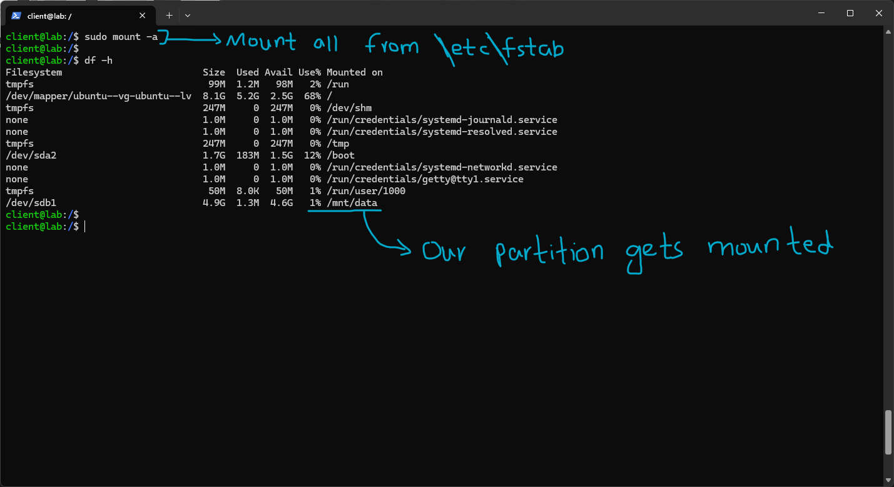

I then unmounted the partition and ran the command `sudo mount -a`, which takes all mount points defined in `/etc/fstab` and mounts their respective partitions on them. I then confirmed that the latest mount point configured in fstab was indeed mounted automatically. I checked this with the command `df -h`, which listed all current mount points along with their partitions.

# Summary

This lab was performed to get a feel for how partitioning works on Linux and how enterprise Linux systems would automate this process. Discovering that `parted` had a scripting flag that allowed for creating scripts to automatically partition disks was a very good learn.
