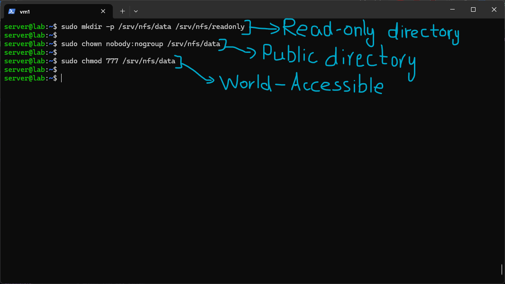
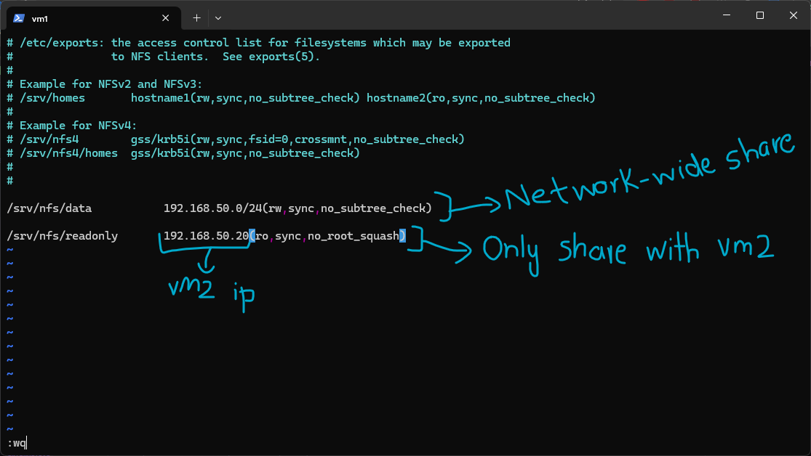
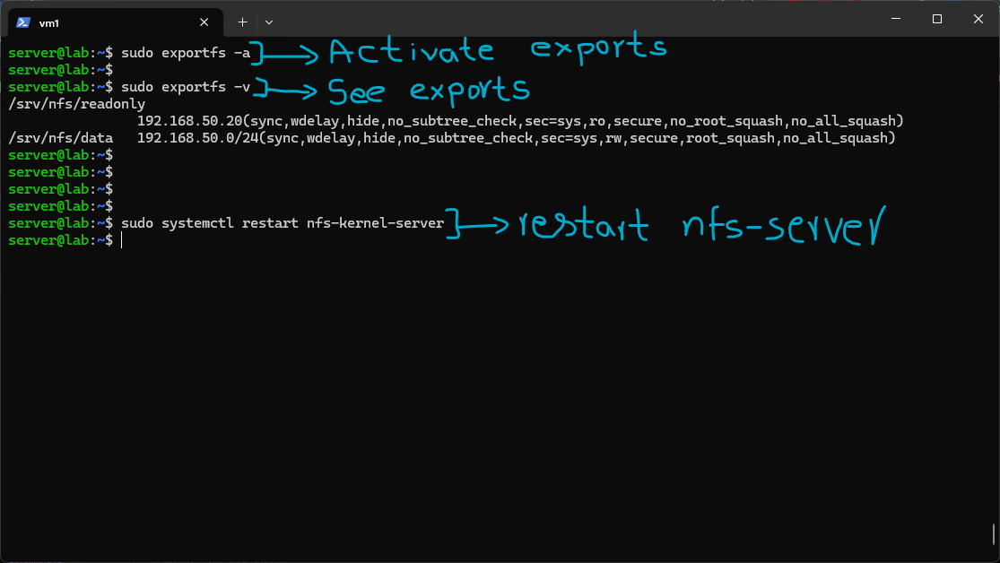
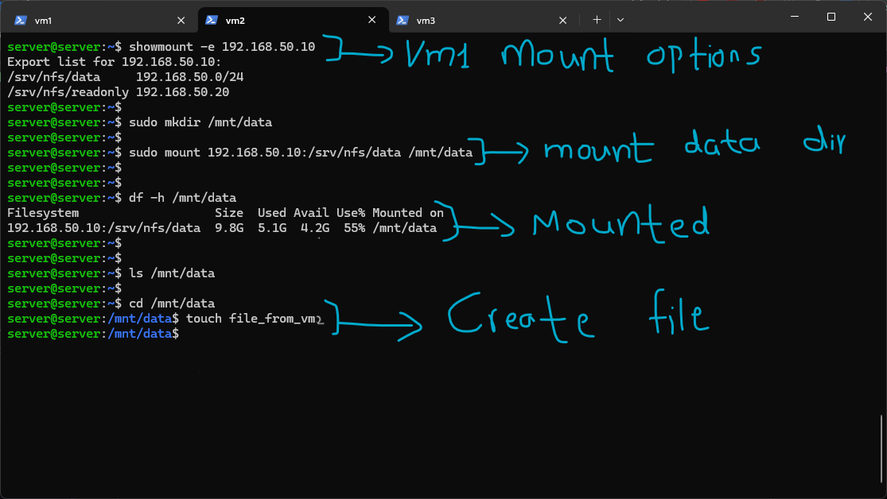
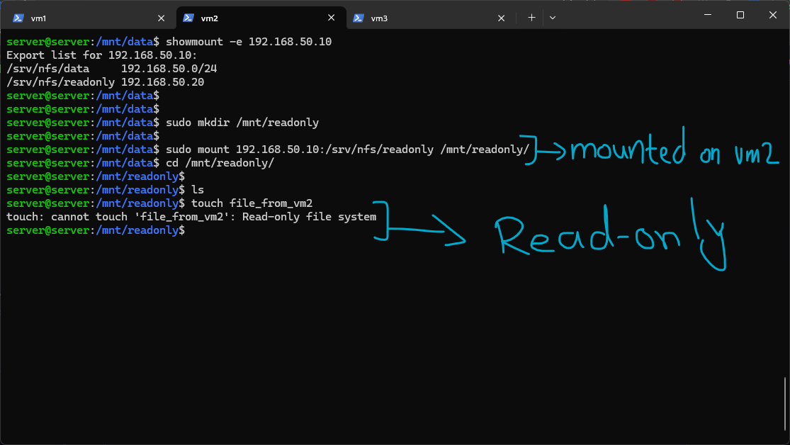
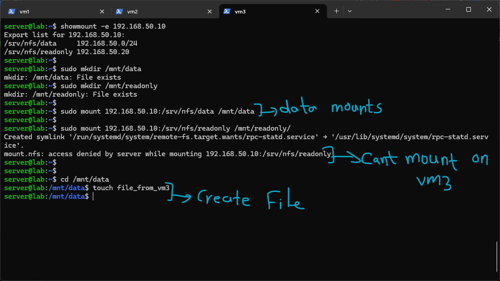
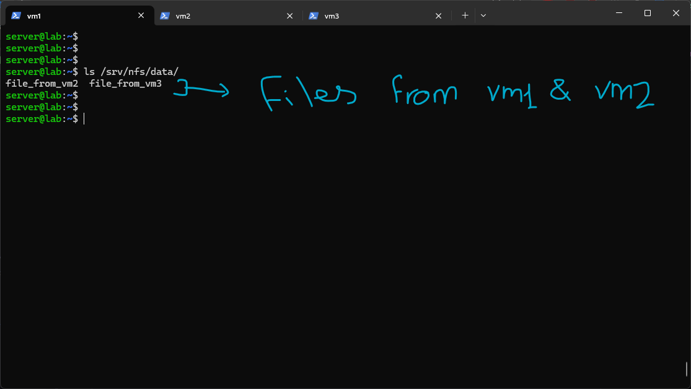

# NFS (Network File System)

NFS is the Linux-native file sharing protocol, in contrast to Samba, which speaks Windows' native SMB protocol. Where Samba exists specifically to make a Linux machine look like a Windows file server to Windows clients, NFS is built for Unix-to-Unix sharing, and as a result it's simpler to configure and more tightly integrated with standard Linux permissions, since it doesn't need to translate between two entirely different security models the way Samba does. It shows up everywhere from ordinary desktop workstations to high-performance computing clusters, anywhere multiple Linux machines need to share a filesystem directly.

This lab used three VMs rather than two, VM1 as the NFS server, and VM2 and VM3 both acting as separate clients, specifically so I could test how access control behaves differently for two clients that are each allowed different levels of access.

# Lab

I installed the NFS server on VM1 with:

```

sudo apt install nfs-kernel-server -y

```



I then created two export directories and set their permissions:

```

sudo mkdir -p /srv/nfs/data /srv/nfs/readonly sudo chown nobody:nogroup /srv/nfs/data sudo chmod 777 /srv/nfs/data

```

`/srv/nfs/data` is meant to be a fully open, writable share, so ownership is set to the generic `nobody:nogroup` placeholder and permissions are set wide open (`777`), the same pattern I used for the public Samba share earlier. `/srv/nfs/readonly` was left with default ownership and permissions at this stage, since its actual restriction was going to be enforced through the NFS export config itself rather than through Unix file permissions.



The real access control for NFS lives in `/etc/exports`, which I configured as:

```

/srv/nfs/data 192.168.50.0/24(rw,sync,no_subtree_check) /srv/nfs/readonly 192.168.50.20(ro,sync,no_root_squash)

```

This file is what actually decides who can mount what, and with what permissions, which is a meaningfully different model than Samba's, where access control was split between the `smb.conf` share definitions and separate Unix permissions on the directories. Here it's centralized in one file per export line:

- `/srv/nfs/data` is exported to the entire `192.168.50.0/24` subnet with `rw` (read-write) access, meaning any machine on this network can mount it and write to it.
- `/srv/nfs/readonly` is exported only to `192.168.50.20`, VM2's specific IP, and only with `ro` (read-only) access. This was the first time I'd used a single specific IP in an export rule instead of a whole subnet, which is the mechanism that later stopped VM3 from mounting it at all.
- `sync` tells the server to write changes to disk before acknowledging them back to the client, which is safer against data loss on a crash than the alternative `async` option, at some cost to raw speed.
- `no_subtree_check` disables an extra verification step NFS normally performs to check that a requested file actually lives within the exported directory tree. This check can cause reliability issues in some situations, and disabling it is a common recommendation for straightforward, whole-directory exports like these ones.
- `no_root_squash` on the readonly export is worth calling out specifically. By default NFS "squashes" the root user on a client machine down to an unprivileged user when accessing an export, specifically to stop a client's root account from having root-level access to the server's filesystem through the mount. Disabling that here means root on VM2 would have full root-level access to this specific export, which is a deliberate loosening I made narrowly for this one read-only share rather than a general practice, and worth remembering as something to reconsider if this share ever needed to be writable.



I activated the exports and restarted the service:

```

sudo exportfs -a sudo exportfs -v sudo systemctl restart nfs-kernel-server

```

`exportfs -a` re-reads `/etc/exports` and applies all the export rules without needing a full service restart. `exportfs -v` then let me verify exactly how each rule was actually being interpreted, and the output confirmed both exports along with the full expanded set of options for each, including some defaults I hadn't explicitly set myself, like `secure` (requiring the client to connect from a privileged port below 1024, a basic sanity check against unprivileged processes impersonating a client) and `wdelay` (a small optimization that briefly delays writes to potentially batch multiple ones together).



On VM2, I checked what was actually available to mount with:

```

showmount -e 192.168.50.10

```

which correctly listed both exports along with their respective access rules, confirming VM2 could see that it specifically had access to `/srv/nfs/readonly` while the whole subnet had access to `/srv/nfs/data`. I then mounted the data share:

```

sudo mkdir /mnt/data sudo mount 192.168.50.10:/srv/nfs/data /mnt/data df -h /mnt/data

```

`df -h` confirmed the mount was live and showed the actual disk usage of the remote filesystem, not a local one, proving this genuinely was VM1's storage being accessed over the network rather than a local directory. I created a test file here with `touch file_from_vm2` to later confirm cross-VM visibility.



I then mounted the readonly share the same way:

```

sudo mkdir /mnt/readonly sudo mount 192.168.50.10:/srv/nfs/readonly /mnt/readonly

```

The mount itself succeeded without issue, since VM2's IP is specifically allowed in the export rule. But attempting to create a file with `touch file_from_vm2` inside it correctly failed with "Read-only file system," confirming the `ro` option in the export was actually being enforced at the protocol level, not just cosmetically, VM2 could see and read the share's contents but genuinely could not modify anything in it.



On VM3, I ran through the identical setup, checking exports, creating mount points, and mounting. The data share mounted the same way it had for VM2, since that export allows the whole subnet. But attempting to mount the readonly share failed outright with "access denied by server," since VM3's IP was never listed in that specific export rule at all. This was the clearest demonstration of the difference between the two exports, VM2 could mount the readonly share but not write to it, while VM3 couldn't even mount it in the first place, showing two distinct layers of restriction, whether a client is allowed to connect at all, versus what it's allowed to do once connected. I created a second test file on the data share from VM3, `file_from_vm3`, to check alongside VM2's file.



Back on VM1, checking the actual export directory directly:

```

ls /srv/nfs/data/

```

showed both `file_from_vm2` and `file_from_vm3` sitting side by side in the same underlying directory, confirming both clients really had been writing to the exact same shared storage on VM1 concurrently, rather than each client having some kind of isolated or cached view of its own.

# Summary

This lab used three VMs specifically to demonstrate that NFS access control operates on two separate layers that both have to be satisfied: whether a given client IP is allowed to mount an export at all (controlled by which IP or subnet appears in `/etc/exports`), and what that client is allowed to do once mounted (controlled by the `rw`/`ro` option on that same export line). VM2 and VM3's genuinely different experiences with the same readonly export, one being able to mount but not write, the other being refused the mount entirely, made this distinction concrete rather than theoretical. Comparing this setup to the earlier Samba lab also highlighted how differently the two protocols centralize their access control, Samba split it across `smb.conf` share definitions, Samba's own separate user database, and Unix file permissions, while NFS folds almost all of it into the single `/etc/exports` file, trusting client IP addresses directly rather than requiring a separate authentication exchange the way Samba does.

