# Reverse Proxy

A reverse proxy sits in front of your backend servers and forwards requests to them. Clients talk to the proxy, they never talk to the backends directly. This enables load balancing, SSL termination, caching, and hiding your backend architecture.

For this lab, I used my site hosted on https://sohaib-lab.duckdns.org via Apache and applied load balancing to it through an nginx reverse proxy using the round-robin algorithm.

I have a know-how of Docker, and it is also included in my professional lab journey going forward. I used an apache2 Docker container to serve my site from two backends: backend_a is my own homelab server, VPS 1, which also has nginx running on the host, load balancing these backends and acting as a gateway. backend_b is the second VPS, named VPS 2, which is totally separate from this network and is also serving the site through an apache2 Docker container. This gave me two genuinely different backends to load balance the traffic on my site.

# Nginx Load Balancing

I started out by installing Docker and setting up the site serving. Since I am using the apache2 image, it was as simple as modifying the config and setting up the directory correctly.

```bash
# Pulled the docker image and created a container
docker pull ubuntu/apache2:latest
docker run -d --name backend_a -p 8081:80 ubuntu/apache2:latest # the name of the container is 'backend_a' and it is mapped to the host port '8081'

# Copied site directory to docker container
docker cp /var/www/sohaib-lab backend_a:/var/www/
```

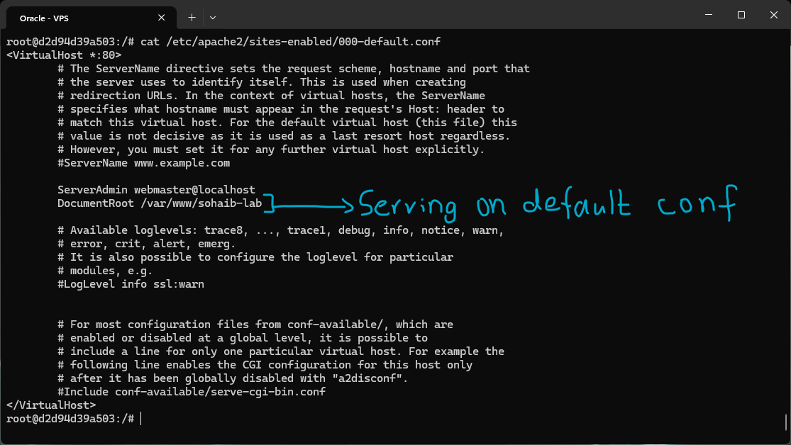

I copied my site directory from the host to the Docker container's `/var/www` and modified the default site config to serve from the directory where my site was located. This is much better since there is no intention of using this container to serve any other sites, so the default one should be serving my own site.

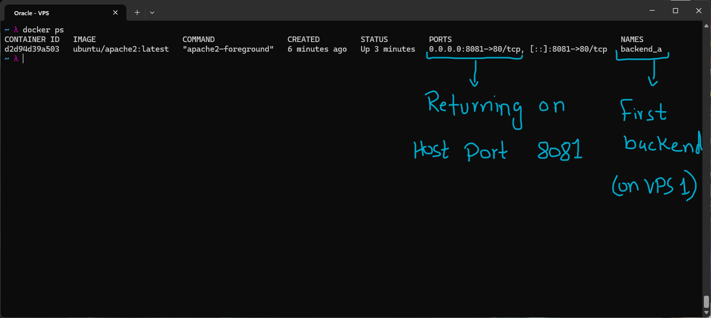

I confirmed that the container was running and was indeed mapped to host port 8081. This finally set up my first backend for the site.

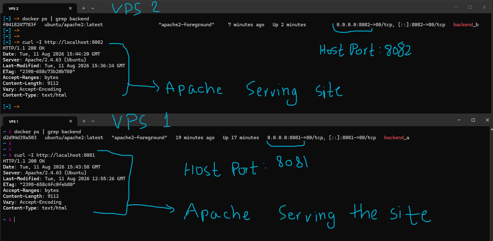

I then repeated the same process on VPS 2 (with the port mapped to 8082 this time) and confirmed through `curl` that the site was indeed being returned by apache2.

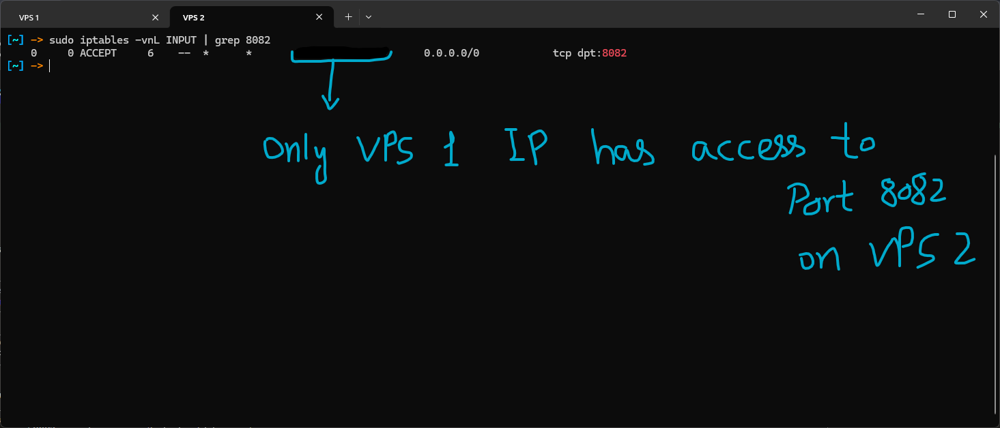

I then allowed incoming traffic from only the IP of VPS 1 on port 8082 of the second VPS. This made sure only VPS 1 could use this specific gateway for accessing the site on VPS 2. This ensures only nginx on VPS 1 has access to the second backend (VPS 2).

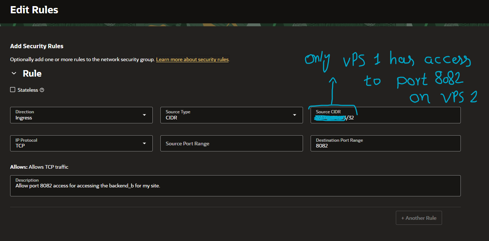

I then had to create an ingress rule in the network security group (NSG) I had set up for VPS 2 in the Oracle dashboard, to allow requests on port 8082 of the VPS from the IP of VPS 1 only.

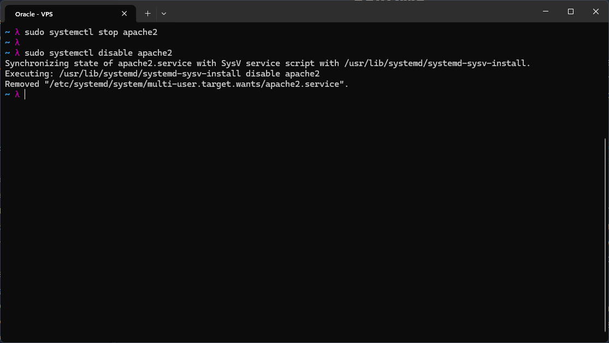

Now that both backends had been set up, I stopped and disabled `apache2`, since there was no need for it anymore, as nginx would be the gateway to both backends serving the site.

I then installed nginx by running `sudo apt install nginx -y`.

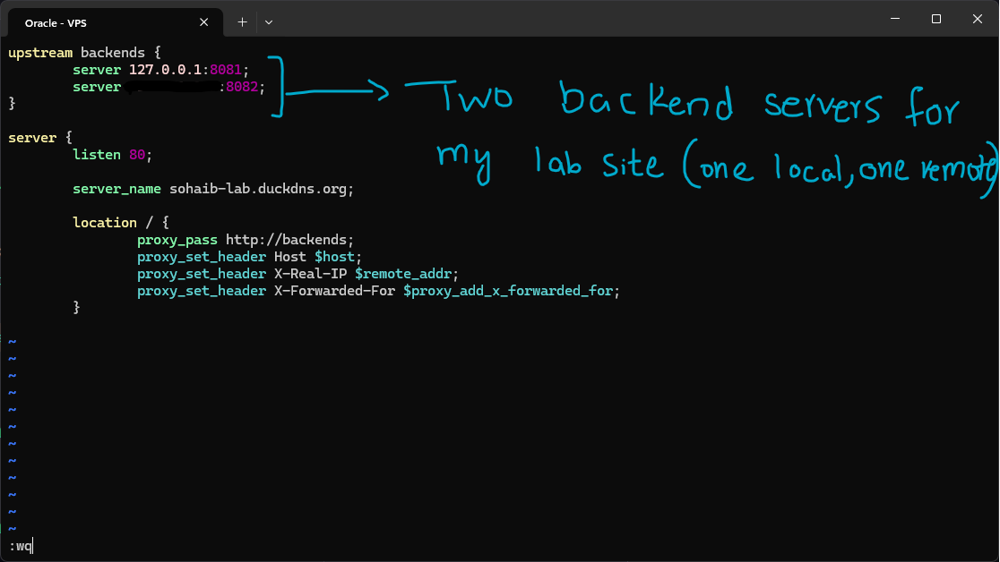

After installing nginx, I created a config file at `/etc/nginx/sites-available/sohaib-lab.conf`, as I had done in the apache2 lab. I set up two upstream servers under the name backends. One was the local container serving the site on host port 8081, and the second was VPS 2 serving the site on its host port 8082, accessible only to the IP of VPS 1. I then added a server block configured to serve the two backends (defaulting to a round-robin algorithm) when requested on port 80. This was deliberate, since I had planned to set up HTTPS through `certbot`, which would use my already issued SSL certificates and configure them for nginx.

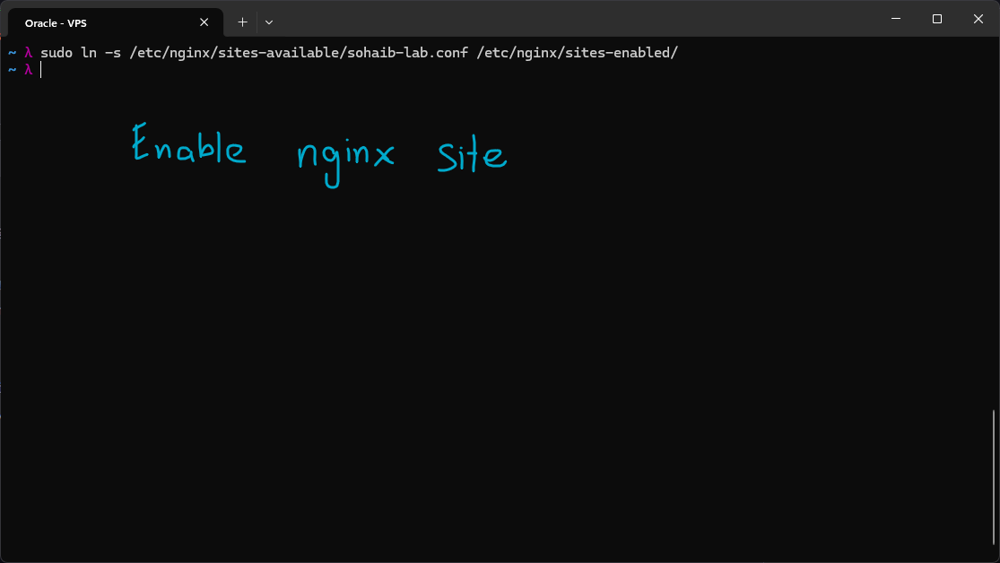

I then enabled the nginx site for which the config was recently created.

`sudo ln -s /etc/nginx/sites-available/sohaib-lab.conf /etc/nginx/sites-enabled/`

This symlinks the sites-available config to the sites-enabled directory, which is automatically used by nginx to serve the site.

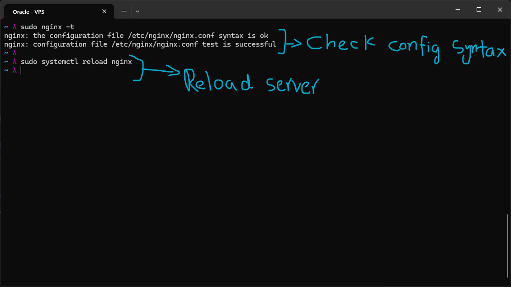

I then checked the syntax of the config and reloaded the server.

```bash
# Check nginx conf syntax
sudo nginx -t

# Reload the server
sudo systemctl reload nginx
```

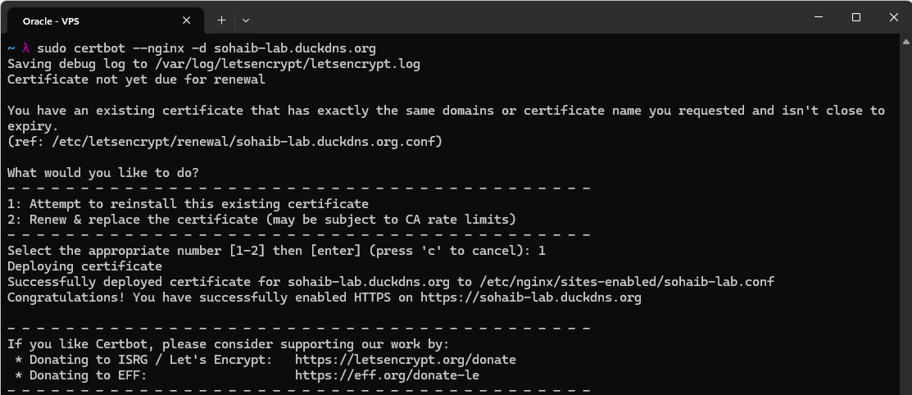

I then ran the command `sudo certbot --nginx -d sohaib-lab.duckdns.org` to get an SSL certificate and set up HTTPS on my domain. Since there were SSL certs already present, it asked if I wanted to use them, and I chose to. The SSL certs issued for apache2 were then applied to my nginx config.

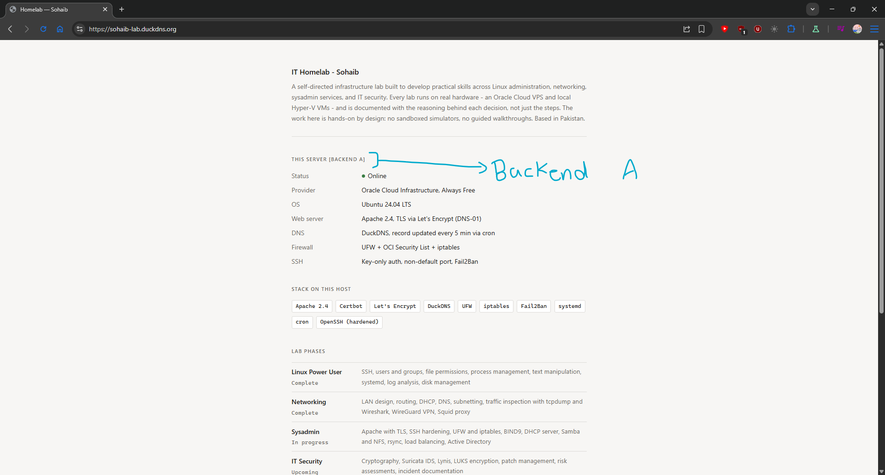
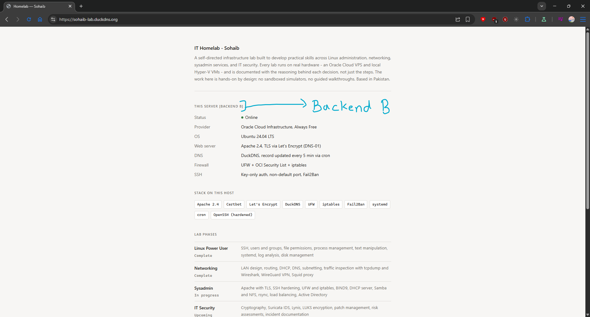

As can be seen here, I modified the actual HTML for the site to be slightly different on both backends. It names the backend it is being served from. Upon hard reloading the page with `CTRL + SHIFT + R`, it definitely uses the other backend previously not used. This also confirms that the algorithm being used by the nginx reverse proxy is indeed round-robin, which goes through the available backends one by one in turn.

## Final Architecture :
```
                         INTERNET
                            │
                            │ HTTPS :443
                            ▼
                 ┌─────────────────────┐
                 │       VPS 1         │
                 │                     │
                 │  NGINX              │
                 │  Reverse Proxy      │
                 │  Load Balancer      │
                 └──────────┬──────────┘
                            │
                 ┌──────────┴──────────┐
                 │                     │
          :8081 │                     │ :8082
                 ▼                     ▼
        ┌────────────────┐    ┌────────────────┐
        │ Docker         │    │ VPS 2          │
        │ Apache         │    │                │
        │ backend_a      │    │ Docker Apache  │
        │                │    │ backend_b      │
        └────────────────┘    └────────────────┘
                                      ▲
                                      │
                              Allowed only from
                                  VPS 1 IP
```

## Load Balancing Algorithms

### Round Robin

The **round-robin** algorithm sends each request to the next server in the upstream group, cycling through the servers sequentially.

It is the **default nginx load balancing method**, so no additional directive is required.

Best suited for **stateless applications where backend servers have roughly equal capacity**.

---

### Least Connections

The **least-connections** algorithm routes a new request to the server that currently has the **fewest active connections**.

Enable it with:

```nginx
least_conn;
```

This is particularly useful for **long-lived connections**, such as WebSockets or database connections, where some requests may remain active much longer than others.

---

### IP Hash

The **IP-hash** algorithm calculates a hash based on the client's IP address and uses it to consistently route that client to the **same backend server**.

Enable it with:

```nginx
ip_hash;
```

This is useful for applications that require **session affinity (sticky sessions)**, such as shopping carts or applications that store session state locally on a backend.

---

### Random

The **random** algorithm selects a backend server **randomly for each request**.

Enable it with:

```nginx
random;
```

This can be useful for **simple request distribution when the backend servers are identical** in capacity and configuration.

---

# Summary

This lab tied together my previous knowledge of apache2, the Oracle firewall, iptables rules, certbot, and Docker to actually set up load balancing for my site (which can update, depending on the progression of the lab at the time, but load balancing will remain).
