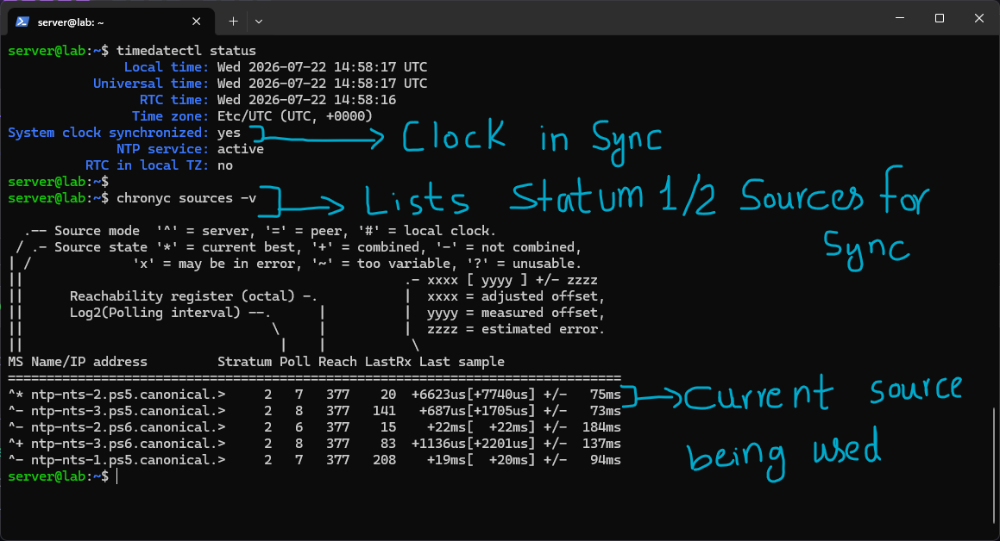
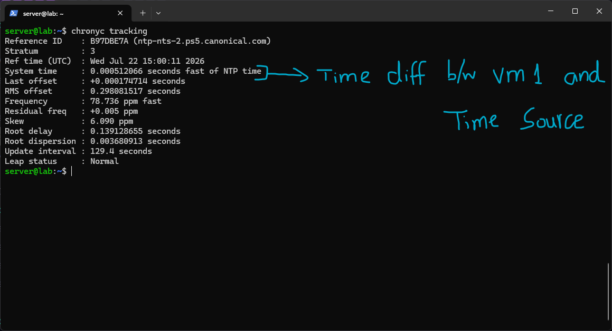
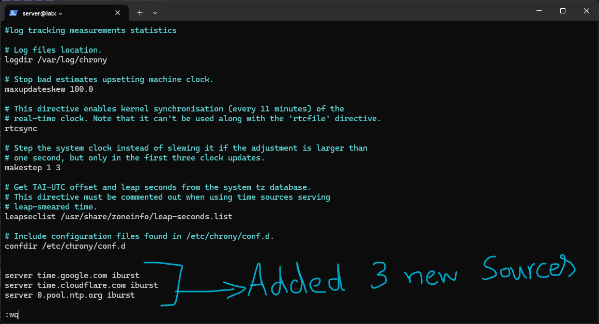
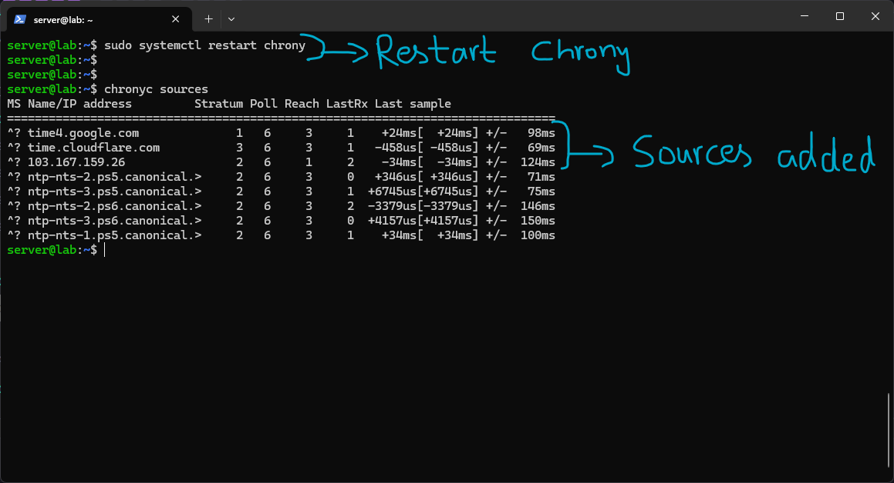
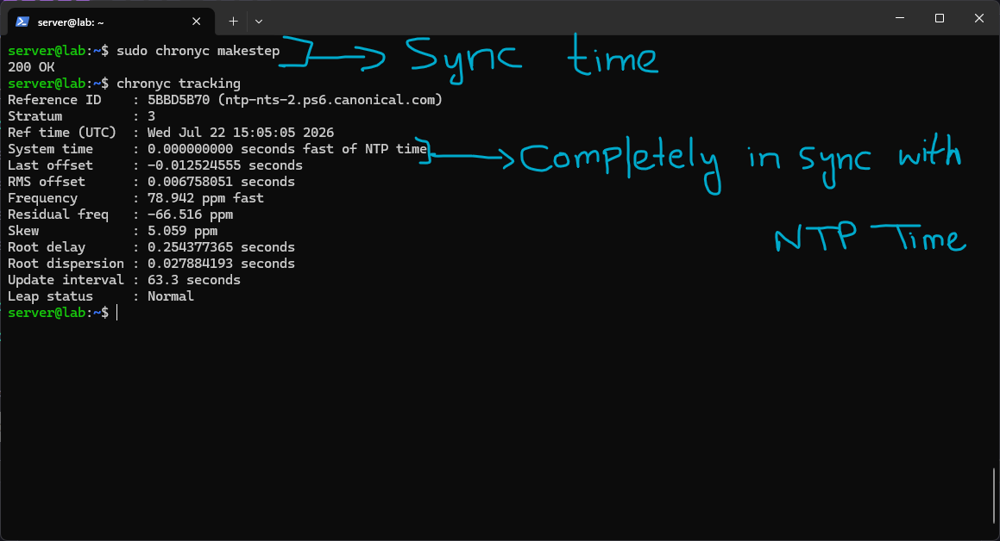

# NTP (Network Time Protocol)

Time synchronization is one of those things that's completely invisible right up until it isn't, and then a surprising number of unrelated systems break at once. TLS certificate validation depends on both sides roughly agreeing on the current time, since certificates have validity windows. Kerberos authentication has strict time skew tolerances and fails outright if two systems drift too far apart. Log correlation across multiple servers becomes effectively impossible if their clocks don't agree, since you can no longer trust that "10:00:05 on server A" and "10:00:05 on server B" actually happened at the same moment. Database replication can go out of sync for similar reasons. None of this is obviously "time related" on the surface, which is exactly what makes NTP the kind of infrastructure people forget exists until something downstream of it starts failing mysteriously.

## Stratums

Time synchronization is organized into stratum levels, essentially describing how many hops removed a given clock is from an actual physical reference clock.

**Stratum 0 — Reference Clocks:** Atomic clocks (caesium, rubidium) and GPS receivers. These aren't network-accessible at all, they connect directly into Stratum 1 servers via serial connections or PPS (Pulse Per Second) signals. Accuracy is measured in nanoseconds. Examples include the NIST atomic clock in Colorado and the atomic clocks onboard GPS satellites.

**Stratum 1 — Primary Time Servers:** Directly connected to Stratum 0 hardware. These are technically internet-accessible but usually restricted in practice, since querying them directly at scale would overload critical infrastructure, so most things query Stratum 2 instead. `time.google.com`, `time.windows.com`, and `time.apple.com` sit at Stratum 1 or 2. Accuracy is in the microsecond range.

**Stratum 2 — Public Time Servers:** Sync from Stratum 1 servers. This is what `pool.ntp.org` provides, a large rotating pool of public Stratum 2 servers, which is what a VPS's `chrony` typically syncs from by default. Accuracy drops to low milliseconds here. Once other machines are configured to sync from that VPS, the VPS itself effectively becomes a Stratum 3 server for them.

**Stratum 3/4 — Client Devices:** Ordinary servers and workstations, syncing from whatever the nearest available NTP source is. Corporate networks commonly run an internal Stratum 2 or 3 server that everything else on the network syncs from, which reduces load on public servers and keeps internal time synchronization working even if internet connectivity drops entirely.

# Lab Work

## chrony

`chrony` is the modern NTP client, installed by default on Ubuntu.



I checked overall sync status with:

```

timedatectl status

```

which confirmed `System clock synchronized: yes` and `NTP service: active`, the two lines that actually matter here, everything else in the output is supporting detail.

I then listed the current time sources with:

```

chronyc sources -v

```

The symbols in the leftmost column matter for reading this output correctly: `^` marks a server-type source, `*` marks whichever source is currently being used as the actual sync reference, and `+` marks a source that's acceptable but not currently the primary choice. The Reach column is shown in octal, and `377` means all 8 of the most recent polling attempts to that source succeeded, a quick way to tell a source is reliably reachable rather than intermittently dropping. The offset columns show how far this machine's clock differs from each source, which is the actual thing being corrected for.

 

I went deeper with:

```

chronyc tracking

```

This showed the Reference ID and hostname of the current best source, confirmed the Stratum this machine is currently operating at (Stratum 3, since it's syncing from Stratum 2 public pool servers), and gave the System time offset, essentially how far fast or slow this machine's own clock is estimated to be relative to true NTP time. This is the tool that actually answers "am I in sync, and by how much," rather than just "do I have sources configured."



To customize the sources being used rather than relying on Ubuntu's defaults, I edited `/etc/chrony/chrony.conf` and added:

```

server time.google.com iburst server time.cloudflare.com iburst server 0.pool.ntp.org iburst

```

The `iburst` option tells chrony to send a burst of several initial polling requests instead of a single one when a source is first contacted, which gets the clock synced faster on startup rather than waiting through the normal, more conservative polling interval before the first correction happens.



After restarting chrony:

```

sudo systemctl restart chrony chronyc sources

```

the newly added sources (Google, Cloudflare, and a pool.ntp.org member) showed up alongside the existing default sources, confirming the config change took effect.

Finally, I forced an immediate correction rather than waiting for chrony's normal gradual adjustment process:

```

sudo chronyc makestep chronyc tracking

```

`makestep` steps the clock immediately to the correct time in one jump, rather than chrony's default behavior of slewing it, gradually speeding up or slowing down the clock over time to correct small differences without ever causing a sudden jump backward or forward, which can otherwise confuse anything relying on strictly monotonic timestamps. After stepping, `chronyc tracking` showed the system time offset at essentially zero, confirming the clock was now fully aligned with the NTP source.

# Summary

The NTP lab connected the abstract stratum hierarchy to actual working commands, `chronyc sources` and `chronyc tracking` are the tools that turn "is my clock in sync" from a vague question into something with concrete, checkable numbers and seeing `makestep` force an immediate correction made the otherwise invisible gradual slewing process something I could actually observe happening.

