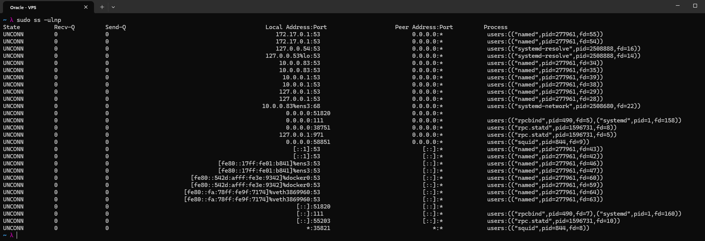
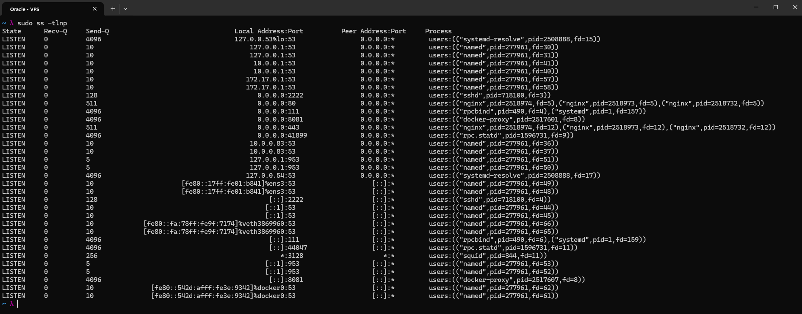
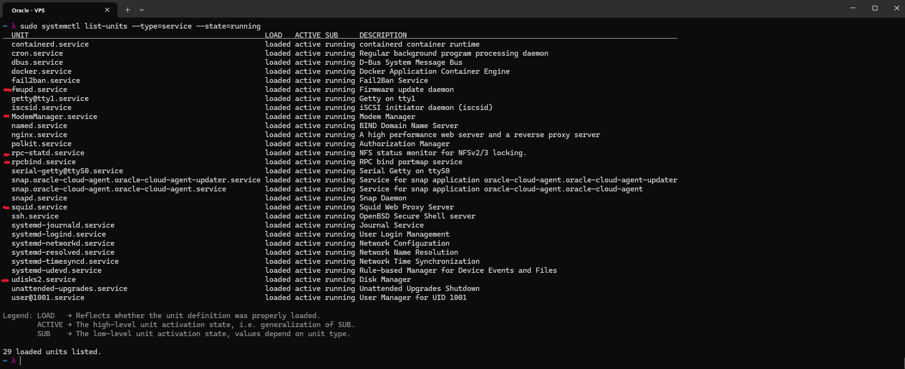
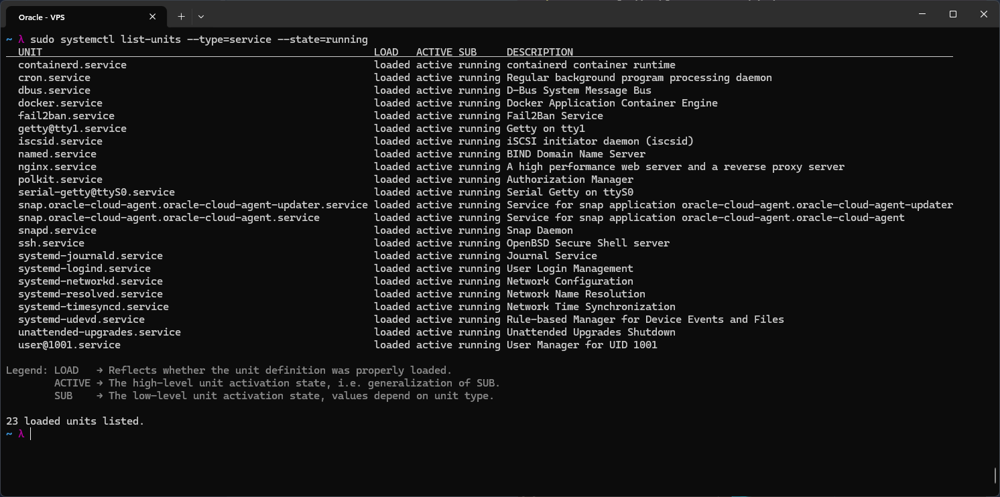
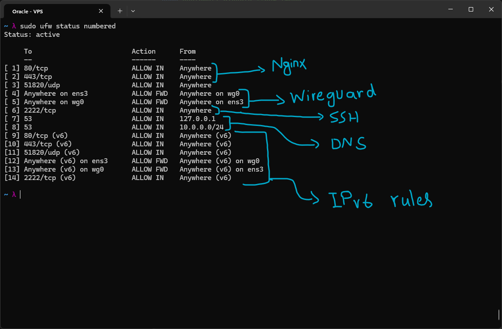
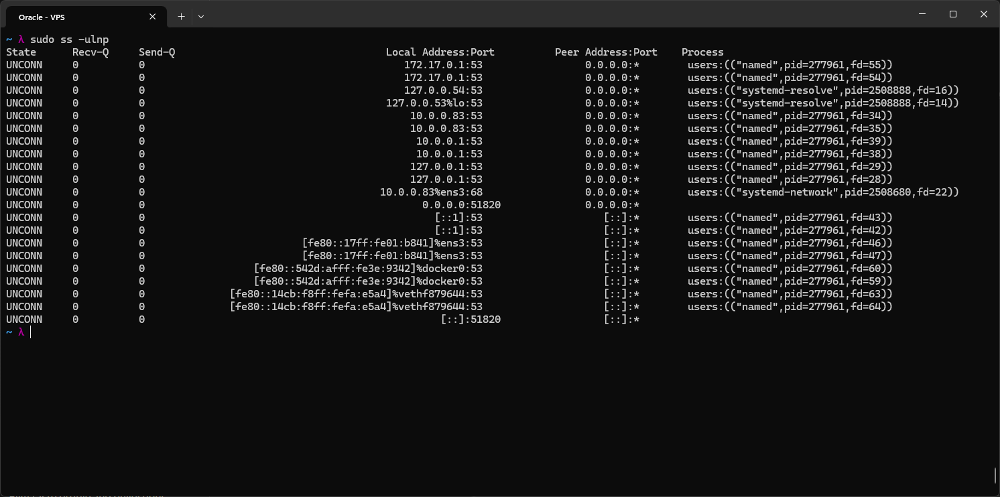
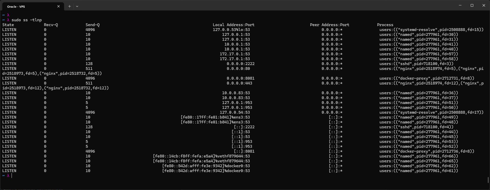
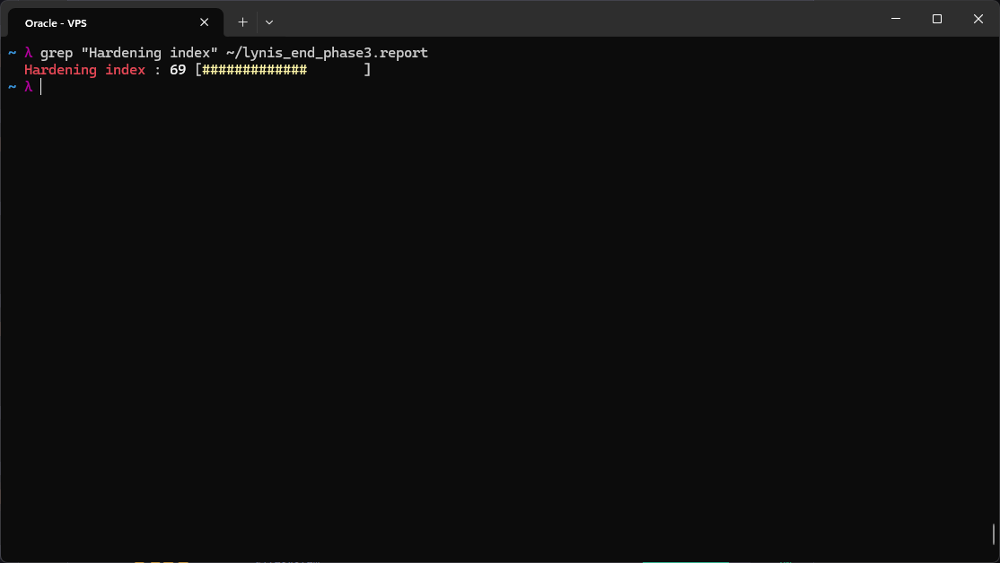

# VPS Port Audit: Justify Every Listener

For this lab I did a full security review of my Oracle Cloud VPS. For every port that showed up as listening and every service that showed up as running, I had to answer three questions: what is it, why does it need to be open, and what happens if I close it. The goal was not just to produce a list of ports, it was to make sure nothing stayed open just because it happened to already be open.

I worked off raw command output instead of assumptions, using `sudo ss -ulnp`, `sudo ss -tlnp`, `sudo systemctl list-units --type=service --state=running`, and `sudo ufw status numbered`. Any time I made a claim about a port being safe, I checked it against the actual config behind it, whether that was BIND, WireGuard, UFW, or the OCI network security group, instead of writing a justification that sounded reasonable without actually verifying it.



This was the starting state for UDP. Most of it was expected: DNS on port 53 from named and systemd-resolve, WireGuard on 51820, and the DHCP client lease renewal on port 68 from systemd-network, which is link-local only and was never a real exposure. Three things I had not accounted for: rpcbind on 111, rpc.statd on 38751 and 971, and squid on 58851 and 35821. None of these were things I set up intentionally on this VPS. rpcbind and rpc.statd both come from NFS tooling, and I have never configured NFS here, so the portmapper and lock manager have nothing to do. Squid was leftover from an earlier lab, and I have no plans to run a forward proxy on this box. Both marked for removal.



TCP told a similar story. Port 2222 is sshd, the non-standard port I moved SSH to. 80 and 443 are nginx, actively serving my lab site and handling TLS termination. Port 8081 is docker-proxy in front of backend_a, the apache container sitting behind the nginx reverse proxy. My first instinct was to say nginx is the only thing that can reach it, but that is an assumption, not a fact, since Docker inserts its own rules directly into iptables and those can bypass UFW's filter table entirely. So instead of trusting the assumption, I checked the OCI network security group and confirmed there is no ingress rule for 8081 from the internet, and UFW has none either. Two independent deny layers protecting it, that is the actual justification, not just "nginx is in front of it." Port 111 shows up again as rpcbind, same verdict as before. 41899 and 44047 are rpc.statd, and 3128 is squid, both tied to the two services already marked for removal.



For DNS specifically, keeping port 53 open needed more than "DNS is fine." named binds to more than just loopback and the WireGuard address, it also shows up on the Docker bridge at 172.17.0.1. What actually makes this safe is not the bind address, it is the `allow-recursion` setting inside the BIND config itself, restricted to loopback and 10.0.0.0/24, the WireGuard subnet. Anything outside that ACL gets refused at the application layer, regardless of which interface named happens to be sitting on. Port 953 is rndc, bound to loopback only, so no exposure there.

Once I had gone through every listening port, I went through `systemctl list-units` for services that do not listen on a network port but were still running by default, and asked the same three questions of each. fwupd is a firmware update daemon, and there is no physical firmware to manage inside a virtualized guest, so I disabled it. ModemManager manages cellular modem hardware, and there is no modem on a VPS, disabled. udisks2 handles automounting removable storage, and there is no removable media on a VPS either, disabled.

Three services I was not sure about, so I looked into each rather than guessing. getty@tty1 is the local virtual console login, nothing to do with SSH, it just sounds related. I left it running since reaching it requires OCI console access anyway, which has its own auth in front of it. iscsid turned out to matter more than it looks, OCI can attach boot and block volumes over iSCSI depending on the instance shape, and disabling this blind could mean the boot volume does not show up on the next reboot, so I left it alone. serial-getty@ttyS0 powers OCI's Serial Console, the emergency access path if SSH ever gets locked out by a bad firewall rule, so this one stays on purpose, not by oversight.

## Cleanup

With the verdicts settled, I ran the actual disable and purge commands:

```bash
# NFS related, disable both explicitly since rpc.statd doesn't depend on rpcbind alone
sudo systemctl disable --now rpc-statd
sudo systemctl disable --now rpcbind

# squid, full removal rather than just stopping it
sudo systemctl disable --now squid
sudo apt purge squid squid-common -y
sudo ufw delete allow 3128

# dead weight, no hardware or use case for these on a VPS
sudo systemctl disable --now fwupd
sudo systemctl disable --now ModemManager
sudo systemctl disable --now udisks2
```



Running services went from 29 down to 23, exactly the six I disabled and nothing else, which was the first confirmation this worked as intended. But a service showing as disabled in systemd is not proof on its own, so I re-ran `ss -ulnp` and `ss -tlnp` afterward.







Every port tied to the six removed services, 111, 38751, 971, 58851, 35821, and 3128, was gone from both listener tables, not just marked inactive in systemd. That is the actual proof the cleanup worked, checking the listener table again instead of trusting service state alone.

Final UFW state, default policy confirmed as deny on incoming and deny on routed traffic:

```
Default: deny (incoming), allow (outgoing), deny (routed)

80/tcp        ALLOW IN    Anywhere
443/tcp       ALLOW IN    Anywhere
51820/udp     ALLOW IN    Anywhere
2222/tcp      ALLOW IN    Anywhere
53            ALLOW IN    127.0.0.1
53            ALLOW IN    10.0.0.0/24
(+ IPv6 equivalents for 80, 443, 51820, 2222)

Anywhere on ens3   ALLOW FWD   Anywhere on wg0
Anywhere on wg0    ALLOW FWD   Anywhere on ens3
```

Since the default policy denies both incoming and routed traffic, the rules above are the only paths into the VPS. Every remaining open port now has a named service behind it, a reason it needs to be open, and a stated consequence if it were closed, instead of being open by default.

One gap I am noting rather than fixing right now: the port 53 rule scoping DNS to loopback and the WireGuard subnet only exists for IPv4, there is no IPv6 equivalent. Not a real risk at the moment, since WireGuard is IPv4 only and the IPv6 bindings on the box are link-local and non-routable, but if IPv6 ever gets added to the WireGuard config later, this rule needs to be mirrored.

## Lynis, end of Sysadmin phase

To close this out with an actual measurement instead of just my own verdicts, I ran a full Lynis audit after the cleanup:

```bash
sudo lynis audit system 2>&1 | tee ~/lynis_end_phase3.report
grep "Hardening index" ~/lynis_end_phase3.report
```



Hardening index came back at 69, up from 66 at the earlier baseline, out of 270 tests performed. Firewall detected and active, malware scanner still not installed, which is the same gap flagged in the baseline and is deferred to the Security phase along with the rest of the suggestions list.

Full scan output for this run is in [lynis_end_phase3](https://github.com/5ingul4ri7y/homelab/tree/main/Audits_and_Reports/lynis_end_phase3), and the earlier baseline it is being compared against is in [lynis_mid_phase3](https://github.com/5ingul4ri7y/homelab/tree/main/Audits_and_Reports/lynis_mid_phase3), if you want to see the two side by side rather than take my word for the delta.

## Summary

The real lesson from this lab was not any single port. It was that "looks safe" and "is safe" are two different claims, and the port 8081 assumption and the DNS interface binding both sat in that gap until I actually checked them. A port audit is only as good as the verification behind each verdict, not the verdict itself.
