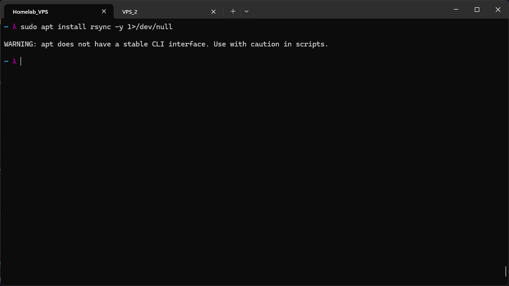
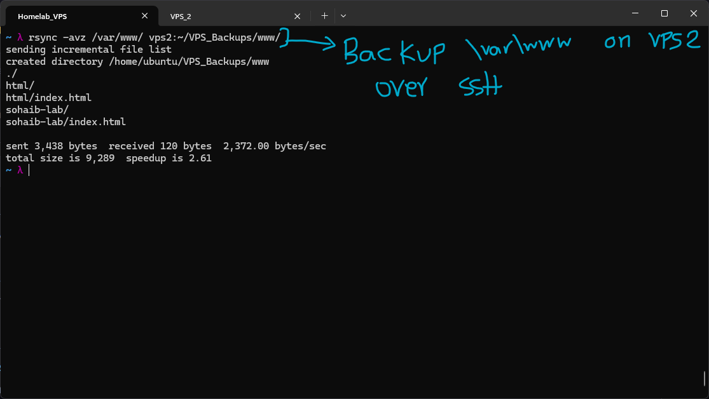
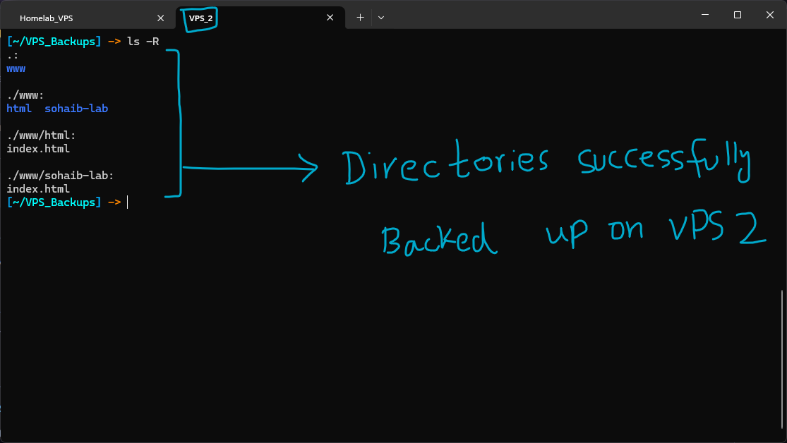
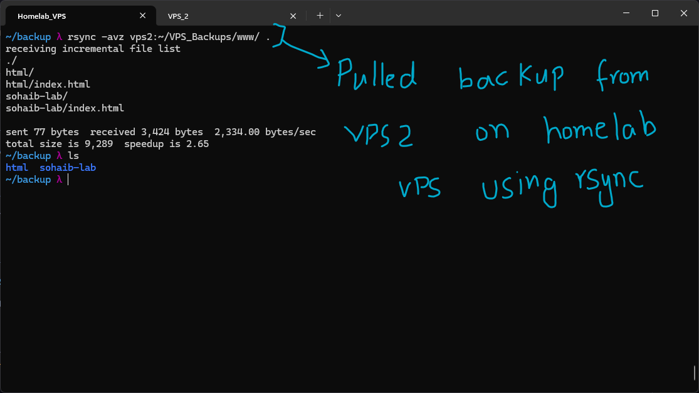
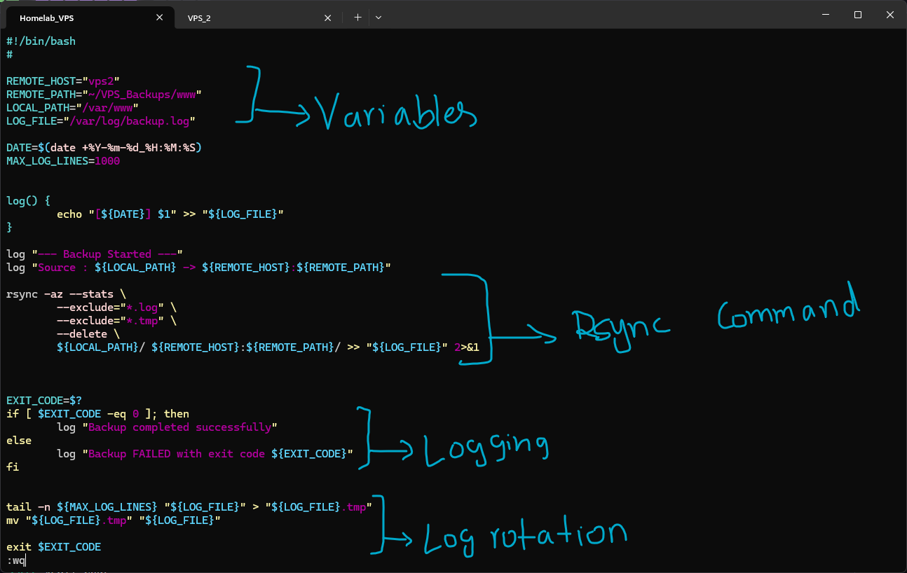
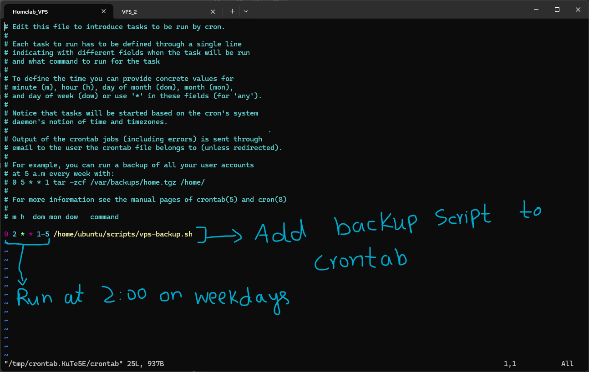
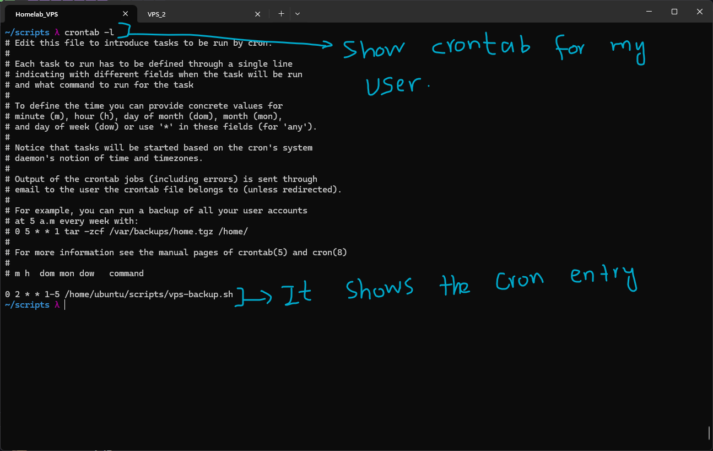
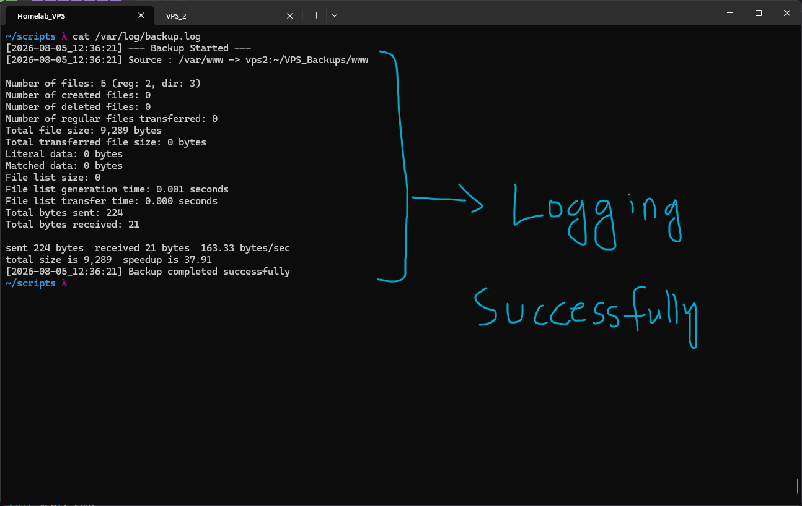

# Backup Automation with rsync and Cron

Backups are one of those things that are easy to ignore until the day they're suddenly the only thing that matters. Hardware fails, software bugs delete data, administrators make mistakes, and occasionally entire servers disappear unexpectedly. The point of a backup is not simply having another copy of the files, but having a reliable way to recover them when something goes wrong.

For this lab I used two VPS instances. One is my homelab VPS where I perform all of my networking and Linux labs. The second is my personal VPS, which acts as an offsite backup server. The goal was to automatically back up the homelab server's `/var/www` directory to the second VPS over SSH using `rsync`, then automate the entire process with a Bash script and cron.

The SSH configuration between both machines had already been completed during earlier labs, so the hostname `vps2` already resolved to the correct server using SSH keys. That meant `rsync` could securely transfer files without requiring passwords or additional authentication setup.

## Why rsync?

`rsync` is considered the standard tool for Linux backups and file synchronization. Rather than copying every file every time, it compares the source and destination and transfers only the parts that have changed (delta synchronization). This makes repeated backups extremely fast and efficient.

Some of the reasons `rsync` is used so widely include:

- Delta synchronization (only changed data is transferred)
- Secure transfers over SSH
- Compression during transfer (`-z`)
- Preservation of permissions, timestamps, ownership and symbolic links (`-a`)
- Ability to mirror directories exactly using `--delete`

Many backup solutions are ultimately built on top of `rsync` or use similar synchronization techniques internally.

---

# Lab

## Installing rsync

Since this VPS is running Ubuntu Minimal, `rsync` was not installed by default.

```bash
sudo apt install rsync -y
```



---

## Testing a Manual Backup

Before automating anything, I first verified that a manual backup worked correctly.

```bash
rsync -avz /var/www/ vps2:~/VPS_Backups/www/
```



The command completed successfully and copied the contents of `/var/www` from the homelab VPS to the backup directory on VPS2.

The options used are worth understanding:

- `-a` (archive mode) preserves permissions, ownership, timestamps and symbolic links.
- `-v` enables verbose output.
- `-z` compresses data during transfer.

Since SSH was already configured, simply specifying `vps2` was enough for `rsync` to establish a secure connection without prompting for usernames or passwords.

---

## Verifying the Backup

To confirm the transfer actually succeeded, I listed the backup directory on VPS2.



The directory structure matched the original `/var/www` directory, confirming that the backup had been copied successfully.

---

## Testing Recovery

A backup is only useful if it can actually be restored.

To verify this, I performed the reverse operation by pulling the backup from VPS2 into a temporary directory on the homelab VPS.

```bash
rsync -avz vps2:~/VPS_Backups/www/ ./
```



The files were restored successfully, demonstrating that the backup could be recovered if the original directory were ever lost. This was only a test restore, but it confirmed that both the backup and recovery processes were functioning correctly.

---

## Automating the Backup

Running `rsync` manually every day would eventually become something easy to forget, so I wrote a Bash script to automate the process.



The script was designed to be reusable rather than solving only this single backup task.

It contains several production-oriented features:

- Variables for source, destination and log file locations.
- Timestamped logging.
- Exit-code checking to determine whether the backup succeeded.
- Automatic log rotation after every 1000 log lines.
- `--stats` output for transfer statistics.
- `--delete` to keep the destination synchronized with the source.

One option worth highlighting is:

```bash
--delete
```

Without this option, files removed from the source server would continue existing forever on the backup server, eventually leaving outdated files behind.

Using `--delete` makes the backup mirror the source exactly. If a file is intentionally removed from the homelab VPS, it is removed from VPS2 during the next synchronization. This keeps the backup clean and accurately reflects the current state of the source server.

The script also writes detailed output to `/var/log/backup.log`.

Since `/var/log` is normally writable only by root, I changed the ownership of `backup.log` so my regular user account could write to it without needing to execute the backup script as root.

---

## Scheduling Automatic Backups

With the backup script working correctly, the final step was to automate it using cron.

I edited my user's crontab:

```bash
crontab -e
```

and added:

```text
0 2 * * 1-5 /home/ubuntu/scripts/vps-backup.sh
```



This schedules the backup to run automatically every weekday at **2:00 AM**.

Running backups overnight minimizes interference with normal server activity while ensuring reasonably up-to-date backups.

---

## Verifying the Cron Configuration

After saving the crontab, I confirmed that the scheduled task had been installed correctly.

```bash
crontab -l
```



The output showed the backup job exactly as expected, confirming that cron would execute the script automatically according to schedule.

---

## Verifying the Backup Log

Finally, I executed the backup script manually and inspected the generated log.

```bash
cat /var/log/backup.log
```



The log contains:

- Backup start time
- Source and destination paths
- Detailed rsync statistics
- Transfer summary
- Success or failure message

Having detailed logs makes troubleshooting much easier than simply knowing that a scheduled backup failed.

---

# The 3-2-1 Backup Rule

A backup is only as reliable as the strategy behind it. One of the most widely recommended approaches is the **3-2-1 backup rule**.

## 3 Copies of Your Data

Keep three copies:

- The original data.
- One backup.
- A second backup.

If the original data and one backup fail simultaneously, another copy still exists.

## 2 Different Storage Media

Avoid storing every copy on the same physical storage.

Two backups stored on the same disk, RAID array, or cloud account still represent a single point of failure.

## 1 Offsite Copy

At least one backup should exist in a different physical location.

Fire, theft, hardware failure, or another disaster that destroys the primary server should not also destroy the backup.

In this lab, the second VPS serves as that offsite backup location, continuously maintaining a synchronized copy of the homelab server's web files over SSH.

---

# Summary

This lab built a simple but production-style backup workflow using `rsync`, SSH, Bash scripting, and cron. A manual synchronization was performed first to verify connectivity, followed by a recovery test to confirm the backup could actually be restored. The process was then automated with a reusable Bash script that adds logging, log rotation, transfer statistics, and exact directory mirroring through `--delete`, before finally being scheduled with cron to run automatically every weekday at 2 AM.

Although this is still a relatively small backup system, it demonstrates many of the same concepts used in production Linux environments: secure remote synchronization, unattended scheduled backups, logging, verification, and maintaining an offsite copy of important data.
