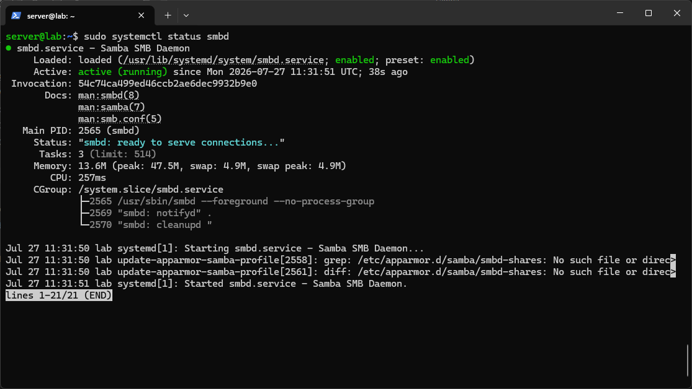
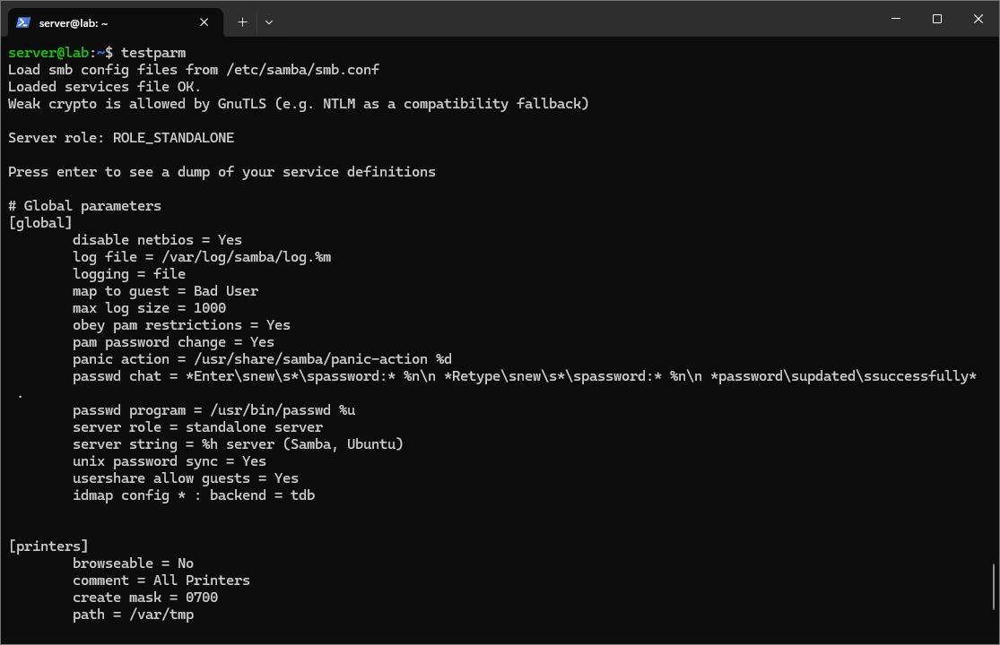
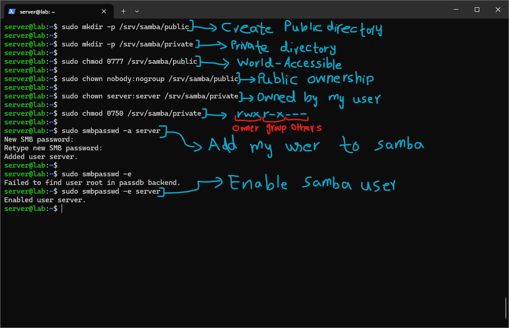
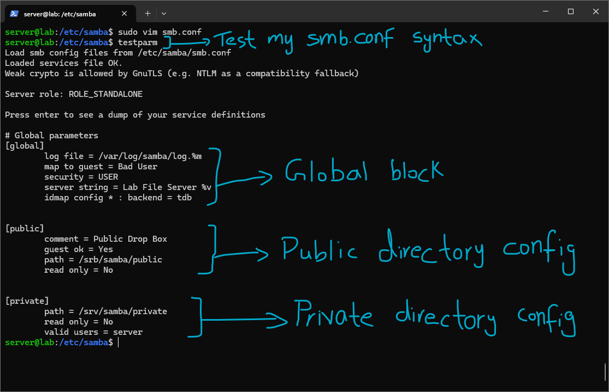
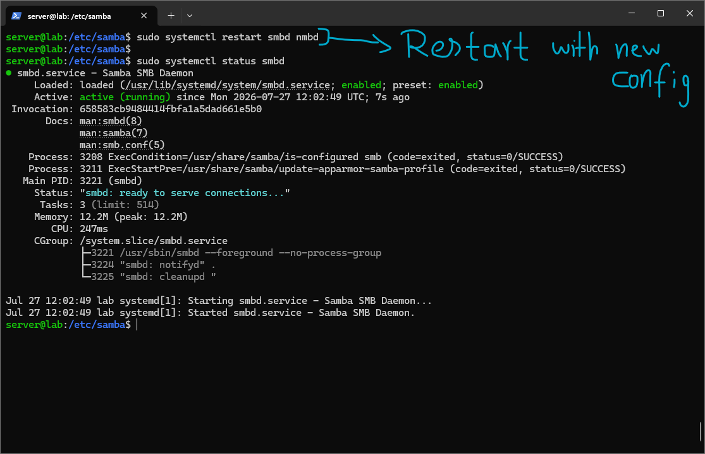
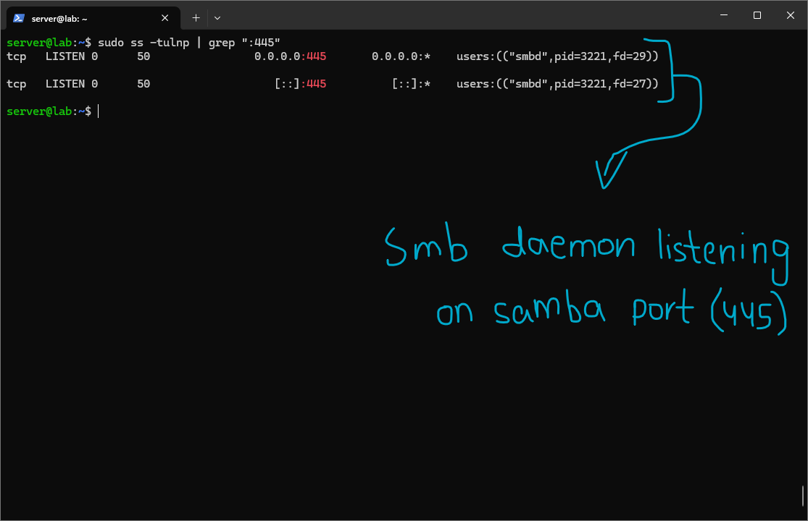
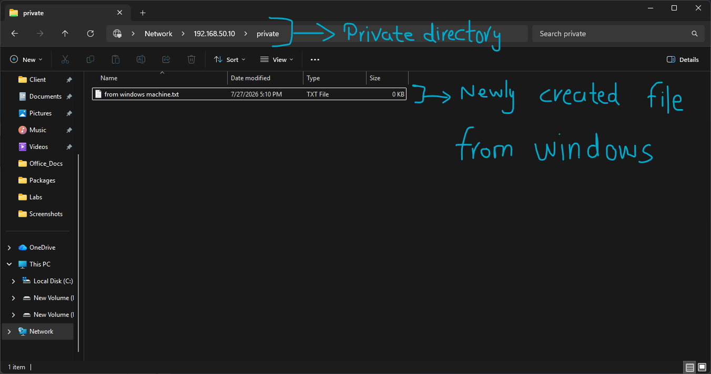
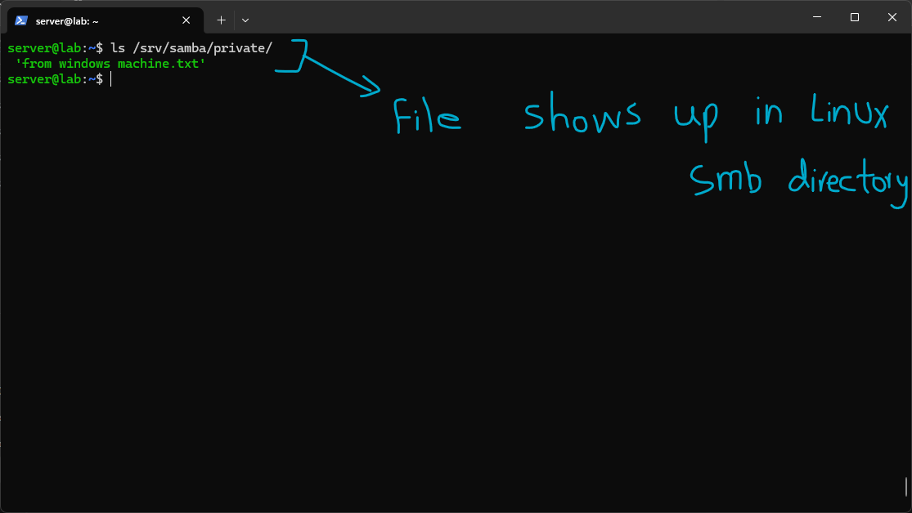
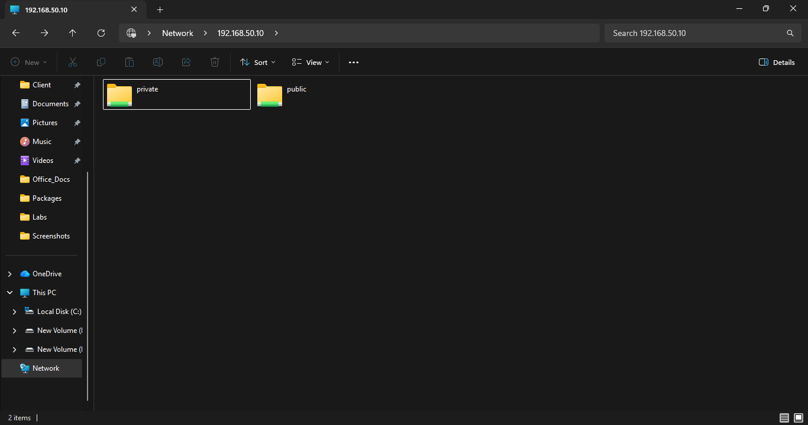

# Samba

Samba implements the SMB (Server Message Block) protocol on Linux, letting Windows clients access Linux file shares exactly as if they were ordinary Windows network drives. It's the standard way file sharing works in mixed-OS environments, where some machines are Windows and some are Linux but everyone still needs to browse the same shared folders without thinking about which OS is actually hosting them.

SMB itself originated on Windows. Samba is a free, open-source reimplementation of that same protocol, which is what lets a Linux machine present itself to Windows clients as if it were a native Windows file server. When browsing `\\192.168.50.10\share` in Windows File Explorer, that's SMB doing the actual talking, and Samba is what makes a Linux box able to answer that conversation correctly.

# Lab

I installed Samba on the Ubuntu Server VM (`192.168.50.10` on the Hyper-V internal LAN) with:

```

sudo apt install -y samba

```



I confirmed the daemon was enabled and running with:

```

sudo systemctl status smbd

```

which showed `active (running)` and "smbd: ready to serve connections."



Before making any changes, I checked the default config's syntax with:

```

testparm

```

This came back OK, and also printed the server role as `ROLE_STANDALONE`, meaning Samba is running independently rather than as part of a Windows Active Directory domain, which makes sense for this lab since there's no domain controller involved anywhere in this setup.



Next I set up the actual directories and permissions:

```

sudo mkdir -p /srv/samba/public sudo mkdir -p /srv/samba/private sudo chmod 0777 /srv/samba/public sudo chown nobody:nogroup /srv/samba/public sudo chown server:server /srv/samba/private sudo chmod 0750 /srv/samba/private

```

The public directory is deliberately wide open, `0777` means read, write, and execute for everyone, and ownership is set to `nobody:nogroup`, the conventional Linux placeholder for "no specific user should be treated as the owner here," matching the idea that anyone should be able to drop files in. The private directory is the opposite, `0750` breaks down as `rwx` for the owner, `r-x` for the group, and nothing at all for others, meaning only my own Linux user (`server`) and members of that group can access it, everyone else is locked out entirely at the filesystem level, before Samba's own permissions even get involved.

I then added my Linux user to Samba's own user database:

```

sudo smbpasswd -a server sudo smbpasswd -e server

```

This was the part that took some getting used to conceptually. Samba passwords are completely separate from Linux passwords, Linux authenticates locally through PAM, but Samba keeps its own independent password database at `/var/lib/samba/private/passdb.tdb`. A user has to exist on the Linux side first, since Samba checks that the username is a real system account, but the actual password Samba accepts over SMB is a second, separately set credential, not automatically synced with the Linux login password. `smbpasswd -a` adds the user and prompts for that Samba-specific password, and `smbpasswd -e` enables the account, since a newly added Samba user is disabled by default until explicitly enabled.



With the directories and user ready, I edited `/etc/samba/smb.conf` and re-ran `testparm` to confirm it still parsed correctly. The config breaks into three logical sections:

- The `[global]` block sets server-wide behavior: the log file location, `map to guest = Bad User` (meaning failed logins fall back to guest access rather than being outright rejected, useful for the public share), `security = USER` (requiring valid Samba credentials rather than allowing anonymous access by default), and a `server string` that's just a descriptive label shown to clients browsing the network.
- The `[public]` block defines the public share: `guest ok = Yes` allows anonymous access, `path = /srv/samba/public` points at the directory created earlier, and `read only = No` allows writing.
- The `[private]` block defines the private share: `path = /srv/samba/private`, `read only = No`, and critically `valid users = server`, meaning only that specific Samba user is allowed to access this share at all, regardless of guest settings elsewhere in the config.



I restarted both Samba services to apply the new config:

```

sudo systemctl restart smbd nmbd sudo systemctl status smbd

```

`smbd` handles the actual file sharing and authentication, while `nmbd` handles NetBIOS name resolution and browsing, letting Samba shares show up by name in Windows' network browsing rather than only being reachable by typing an IP address directly. The status check confirmed it restarted cleanly and was active again with the new config loaded.



I confirmed Samba was actually listening on the network with:

```

sudo ss -tulnp | grep ":445"

```

This showed `smbd` bound to TCP port 445, the standard SMB port, on both IPv4 and IPv6, which confirmed the service wasn't just running as a process but actually accepting incoming connections.



From my Windows machine, I connected to the private share directly by typing `\\192.168.50.10\private` into File Explorer's address bar. This correctly prompted for a username and password, which matches the `valid users = server` restriction from the config, this share should never be accessible without valid credentials, and it wasn't. After authenticating, I created a test file directly from Windows to confirm write access was actually working, not just read access.



Back on the Linux side, checking the same directory directly with:

```

ls /srv/samba/private/

```

showed the exact file I'd just created from Windows, confirming the write genuinely landed on the Linux filesystem rather than Windows just caching it locally or silently failing.



Finally, browsing to the Network section in File Explorer and navigating to `192.168.50.10` showed both the `public` and `private` shares listed and browsable by name, confirming `nmbd`'s name resolution and share advertising was working correctly, not just the raw file transfer itself.

# Summary

This lab covered the full path from a bare Samba install to two working, correctly permissioned shares reachable from a real Windows client. The main conceptual piece that stuck out was the separation between Linux authentication and Samba's own password database, it would have been easy to assume a Linux user account alone was enough to log into an SMB share, but Samba deliberately keeps that boundary separate. Combining Unix filesystem permissions (the `0777` vs `0750` split) with Samba's own share-level config (`guest ok` vs `valid users`) also made clear that access control here happens at two layers that both have to agree, a share can be wide open in `smb.conf` and still be blocked at the filesystem level, or the reverse, and getting the actual behavior right meant setting both correctly rather than assuming one implied the other.

