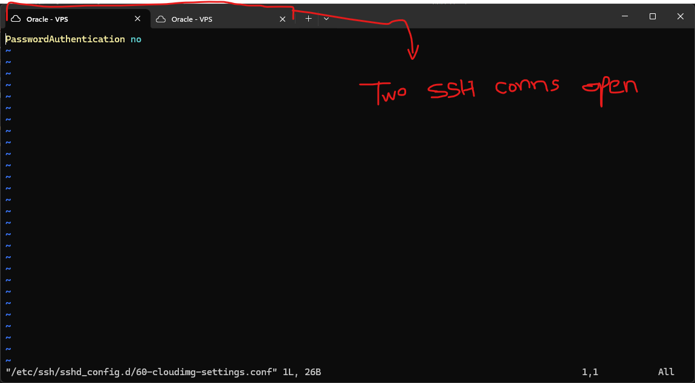
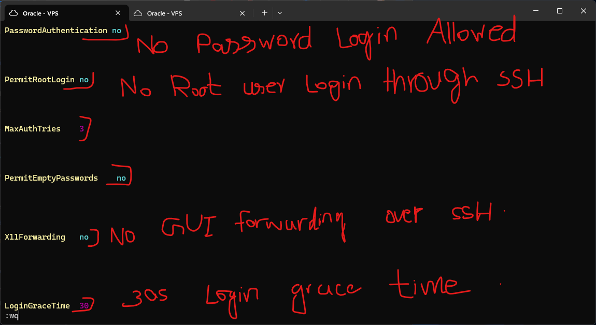
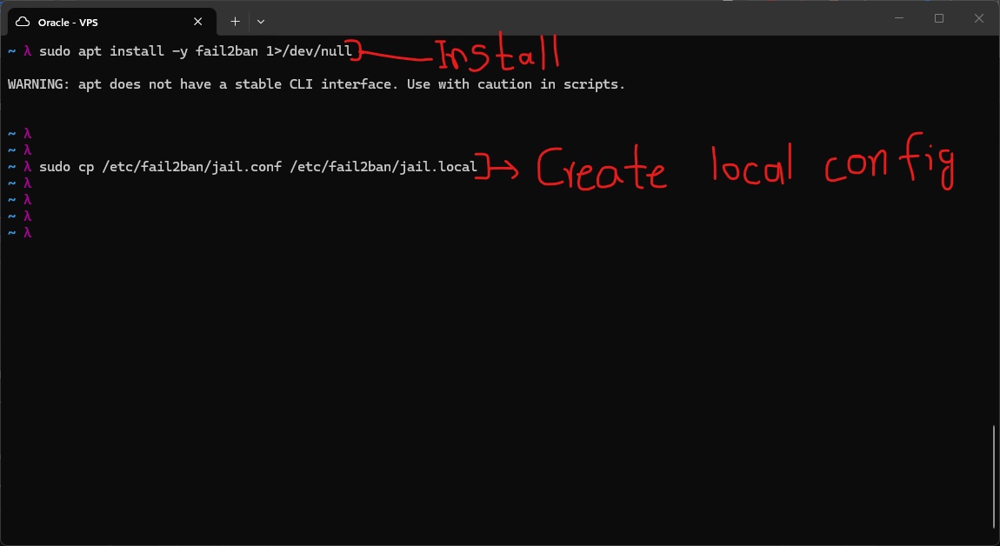
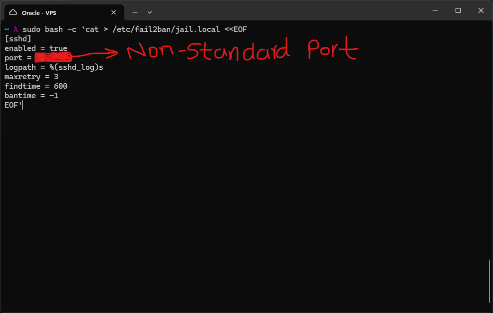
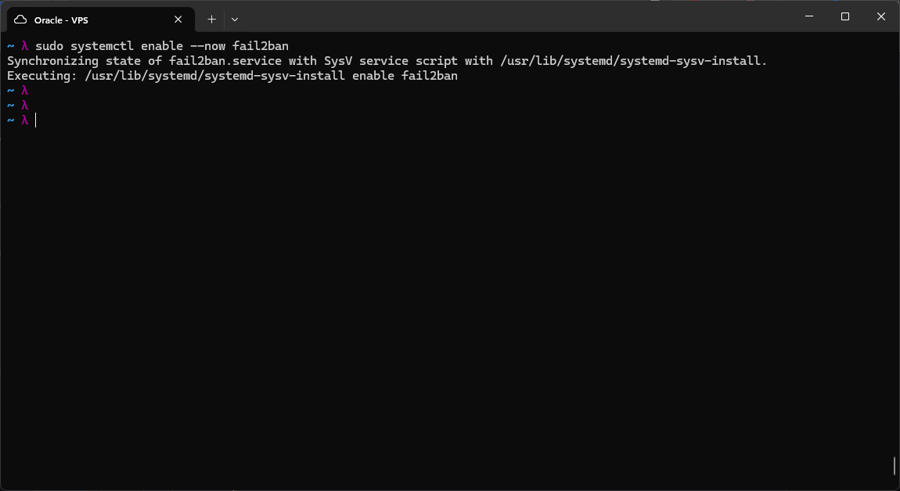
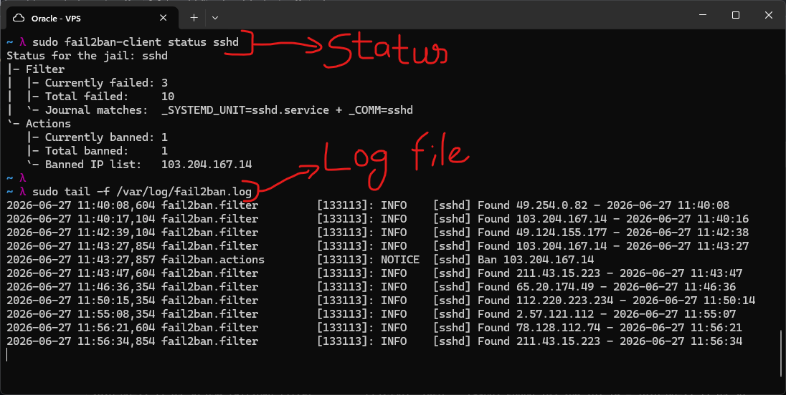

# SSH Hardening and Fail2Ban

SSH is the primary way to access a remote Linux server. On a public-facing VPS, the
SSH port is constantly scanned and probed by automated bots. Hardening SSH is one of
the first things to do after a server is provisioned.

This lab covers two layers of SSH security: locking down the SSH daemon configuration
to remove unnecessary features and attack surface, and deploying fail2ban to
automatically ban IPs that repeatedly fail authentication.

---

## SSH Daemon Configuration

The main SSH config file is `/etc/ssh/sshd_config`, but on Oracle Cloud VPS images
there is an additional file included via the `Include` directive:

```

/etc/ssh/sshd_config.d/60-cloudimg-settings.conf

```

This file is the correct place to apply hardening changes on Oracle Cloud instances.
It overrides defaults cleanly without modifying the base config file.

Before editing, two SSH sessions were opened in separate tabs. This is a standard safe
practice: if the config change breaks SSH, the existing session stays alive and can be
used to fix the mistake before getting locked out.



### Config Changes Applied

The following directives were added to `60-cloudimg-settings.conf`:

```

PasswordAuthentication no PermitRootLogin no MaxAuthTries 3 PermitEmptyPasswords no X11Forwarding no LoginGraceTime 30

````



**PasswordAuthentication no** -- Disables password-based login entirely. Only SSH key
authentication is accepted. Oracle Cloud VPS images ship with this already set, but it
is worth confirming explicitly. Passwords are vulnerable to brute-force; keys are not.

**PermitRootLogin no** -- The root account has unrestricted access to the entire
system. Disabling direct root login over SSH means an attacker would need to compromise
a regular user account first, then escalate privilege separately. This adds a step
attackers must clear.

**MaxAuthTries 3** -- The default is 6. Reducing this to 3 means the server drops the
connection after 3 failed authentication attempts. This slows down brute-force tools
that try many keys or passwords in a single connection.

**PermitEmptyPasswords no** -- Blocks accounts that have no password set from logging
in via SSH. This should always be disabled on any internet-facing server.

**X11Forwarding no** -- X11 forwarding tunnels a graphical display session over SSH.
This VPS runs headless (no GUI), so this feature has no legitimate use here. Leaving
it enabled unnecessarily exposes an attack surface. Disabled.

**LoginGraceTime 30** -- The server waits up to 30 seconds for a client to complete
authentication after the TCP connection is established. The default is 120 seconds.
Reducing this limits how long a half-open connection can tie up server resources,
which is relevant against connection-flooding attacks.

### Changing the SSH Port

The SSH port was also changed from the default port 22 to a non-standard port. This
step was done off-screen. The new port was opened in both the Oracle Cloud OCI Security
List and via iptables before the old port was closed. Changing the port does not
improve security against a targeted attacker but eliminates a large volume of automated
scanning traffic that only probes port 22.

After any sshd config change, the daemon must be reloaded:

```bash
sudo systemctl reload ssh
````

Connectivity was verified on the second SSH tab before closing the first session.

---

## Fail2Ban

fail2ban is a log-monitoring daemon that automatically creates firewall rules to block IPs that show signs of brute-force behavior. It watches log files for patterns (such as repeated failed authentication entries) and issues an iptables DROP rule for the offending IP when a threshold is crossed. After a configured ban duration, the rule is removed automatically.

### Installation

```bash
sudo apt install fail2ban -y
```



### Configuration

fail2ban ships with a default config at `/etc/fail2ban/jail.conf`. This file should not be edited directly because package updates can overwrite it. Instead, a local override file is used:

```bash
sudo cp /etc/fail2ban/jail.conf /etc/fail2ban/jail.local
```

The `.local` file takes precedence over `.conf`. A minimal SSH jail was written to `jail.local`:

```ini
[sshd]
enabled = true
port = <your-ssh-port>
logpath = %(sshd_log)s
maxretry = 3
findtime = 600
bantime = -1
```



**enabled = true** -- Activates this jail.

**port** -- Set to the non-standard SSH port configured earlier. fail2ban needs to know which port to block when issuing ban rules.

**logpath = %(sshd_log)s** -- A built-in variable that resolves to the correct SSH log path for the current system (on Ubuntu this is the systemd journal for sshd).

**maxretry = 3** -- An IP is banned after 3 failed attempts within the findtime window.

**findtime = 600** -- The window is 600 seconds (10 minutes). The retry counter resets if no failures occur within this window.

**bantime = -1** -- A value of -1 means the ban is permanent. The IP is never automatically unbanned. This is appropriate for a homelab VPS that has no legitimate reason to accept repeated failed logins from unknown IPs.

### Enabling the Service

```bash
sudo systemctl enable --now fail2ban
```

The `--now` flag starts the service immediately in addition to enabling it at boot.



### Verifying It Works

```bash
sudo fail2ban-client status sshd
```

This shows the current state of the SSH jail: how many IPs have been seen failing, how many are currently banned, and the list of banned IPs. Within minutes of starting, fail2ban had already recorded failed login attempts and banned an IP.

```bash
sudo tail -f /var/log/fail2ban.log
```

The live log shows fail2ban actively finding IPs from the SSH auth log. Each `Found` line means an IP triggered a failed-auth pattern. The `Unban` line shows the automatic unban cycle working (for jails with a finite bantime). With `bantime = -1` configured, new bans will not unban automatically.



The volume of activity visible in the log within minutes of setup illustrates why these controls matter on any public-facing server. Automated scanners probe SSH continuously.


---


