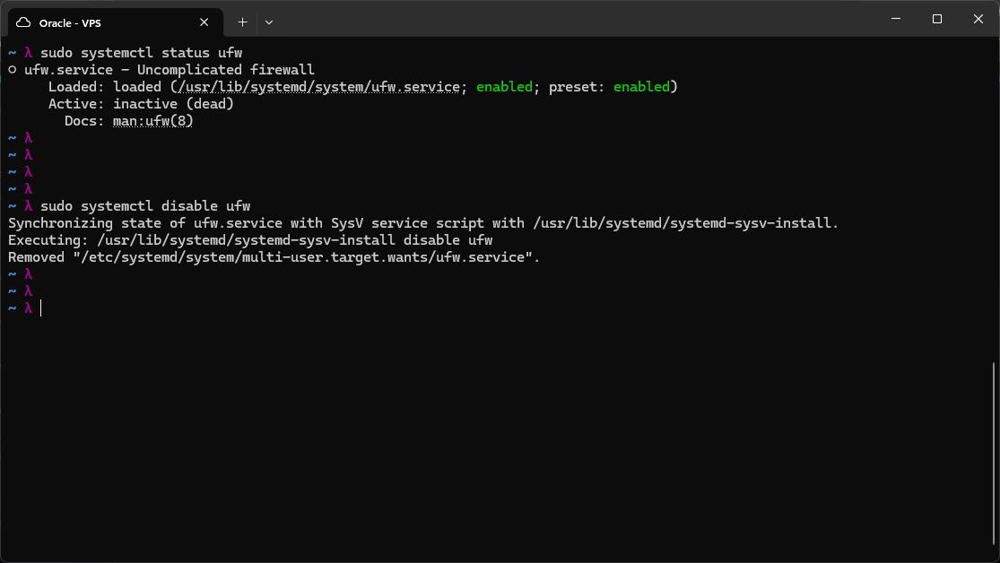
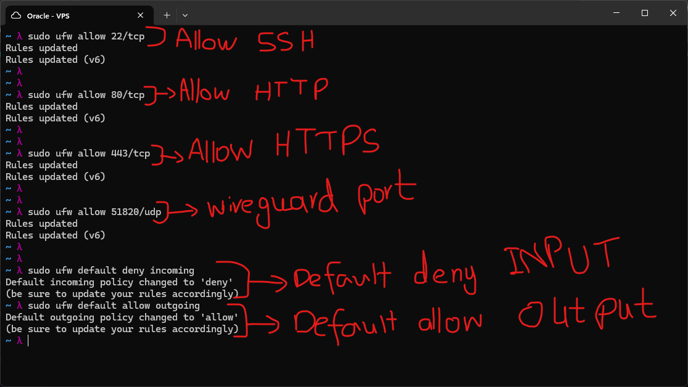
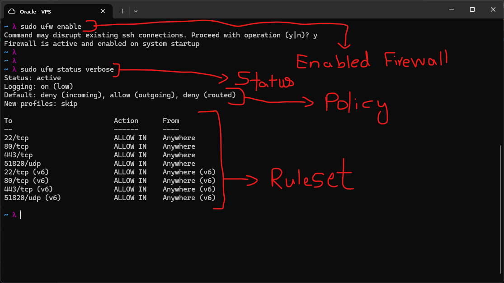
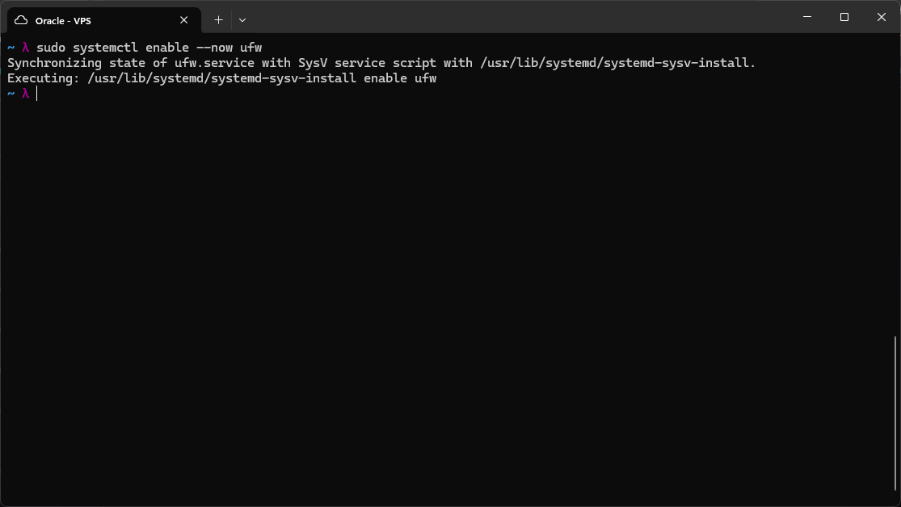
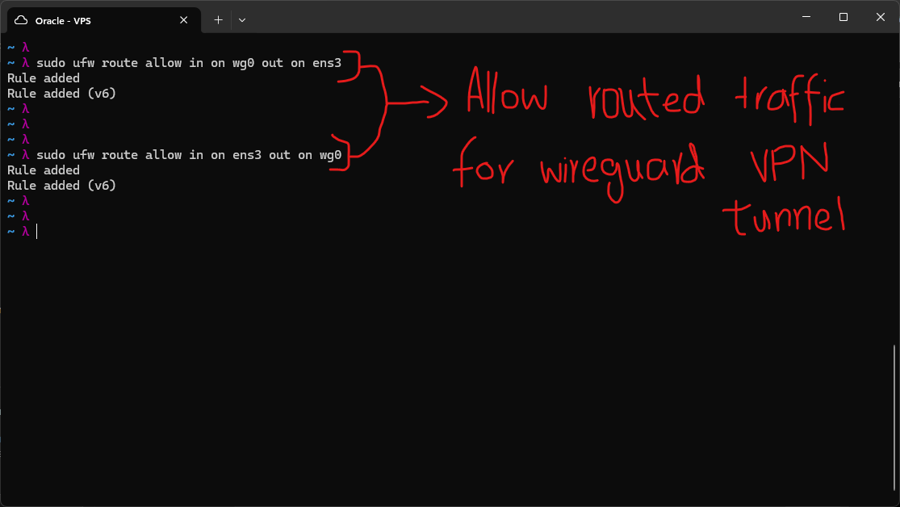
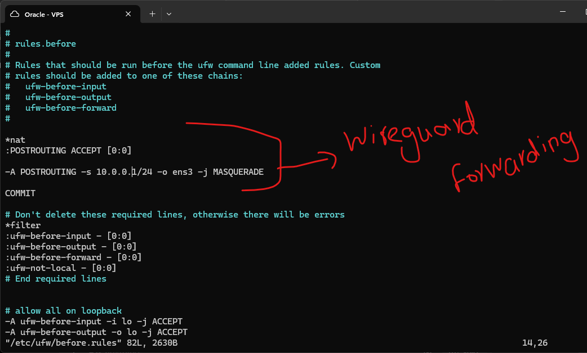

## Screenshot Assessment

All 6 are safe. The Oracle VPS terminal tabs show no hostname, username, RAM, CPU, or kernel info anywhere in these outputs — just ufw command output and a vim view of `before.rules`. Network interface names (`ens3`, `wg0`) and the WireGuard internal subnet (`10.0.0.0/24`, a private RFC1918 range used for the VPN tunnel) are not sensitive. Clear to push.

One thing to flag for accuracy: in **ufw6.png**, your before.rules content reads `-o ens3` correctly, but your rough notes typed `ense3` (typo) — I've fixed that in the README below.

---

# UFW (Uncomplicated Firewall)

UFW is a wrapper around iptables, covered in the previous lab. It trades some of
iptables' flexibility for a much simpler, human-readable command syntax. Rules that
would take a multi-flag iptables command can usually be expressed in a single short
UFW command.

The golden rule for any firewall, especially on an internet-facing VPS, is default
deny: block everything by default and explicitly allow only the services that are
actually needed. This is the same deny-by-default model used in the iptables firewall
script from the previous lab.

## Disabling UFW Before Configuring

```bash
sudo systemctl status ufw
sudo systemctl disable ufw
````

UFW ships installed but inactive on this VPS. Before adding any rules, the service was explicitly disabled so that no default ruleset could interfere while rules were being staged. This avoids accidentally locking out SSH access mid-configuration.



## Adding Rules

```bash
sudo ufw allow 22/tcp
sudo ufw allow 80/tcp
sudo ufw allow 443/tcp
sudo ufw allow 51820/udp
sudo ufw default deny incoming
sudo ufw default allow outgoing
```

Each `allow` rule opens a specific port and protocol:

- **22/tcp** -- SSH
- **80/tcp** -- HTTP
- **443/tcp** -- HTTPS
- **51820/udp** -- WireGuard VPN

`sudo ufw default deny incoming` sets the default policy for inbound traffic to deny. This is roughly equivalent to `sudo iptables -P INPUT DROP` from the iptables lab, but expressed through UFW's own policy mechanism rather than iptables directly.

`sudo ufw default allow outgoing` sets the default policy for outbound traffic to allow, equivalent to `sudo iptables -P OUTPUT ACCEPT`. Allowing outbound by default is common on a server since outbound connections are usually initiated by trusted processes (package managers, the server itself reaching out), unlike inbound traffic which can come from anyone.

UFW applies each rule to both IPv4 and IPv6 automatically, which is why each command prints two confirmation lines.



## Enabling the Firewall

```bash
sudo ufw enable
sudo ufw status verbose
```

`ufw enable` activates the firewall immediately and persists it across reboots. UFW warns that enabling it may disrupt existing SSH connections if SSH was not already allowed -- since port 22 was already permitted in the previous step, this was safe to confirm.

`ufw status verbose` shows the current state: firewall active, logging level, the default policies for incoming, outgoing, and routed traffic, and the full ruleset currently applied.



```bash
sudo systemctl enable --now ufw
```

This ensures the UFW service itself is enabled at the systemd level, so the firewall state is restored automatically if the VPS reboots.



## Allowing Routed Traffic for WireGuard

```bash
sudo ufw route allow in on wg0 out on ens3
sudo ufw route allow in on ens3 out on wg0
```

WireGuard creates a virtual network interface (`wg0`) for the VPN tunnel. By default, UFW's FORWARD chain policy blocks routed traffic between interfaces, which would prevent VPN clients from reaching the internet through the VPS.

The first rule allows traffic coming in on the WireGuard interface to be forwarded out through the VPS's main network interface (`ens3`). The second rule allows the reverse path: traffic coming in on `ens3` to be forwarded back out through `wg0`. Together, these two rules let WireGuard clients route their traffic through the VPS and back, which is what makes the VPN functional rather than just an isolated tunnel with no internet access.



## NAT Masquerading for WireGuard

```
*nat
:POSTROUTING ACCEPT [0:0]

-A POSTROUTING -s 10.0.0.0/24 -o ens3 -j MASQUERADE

COMMIT
```

This block was added to `/etc/ufw/before.rules`, which contains rules that run before UFW's own command-line-added rules are applied. The custom NAT table here performs source NAT (masquerading) on traffic originating from the WireGuard subnet (`10.0.0.0/24`) as it leaves through `ens3`.

Without this, WireGuard clients would have packets with their internal VPN IP as the source address, which the wider internet has no route back to. Masquerading rewrites the source address to the VPS's public IP for outbound packets and reverses the translation for the return traffic, the same NAT mechanism that lets an entire home network share one public IP. This is the functional equivalent of the iptables `nat` table rules and is what allows the VPS to act as a proper VPN gateway rather than just a routing relay.



## Conclusion

UFW trades iptables' fine-grained control for speed and readability. For a VPS where the firewall needs are well understood and don't require complex chains or custom matching logic, UFW is fast to configure correctly and easy to audit later by reading `ufw status verbose`. It is a reasonable choice for production servers where simplicity reduces the chance of a misconfiguration, though iptables (or nftables) remains the better tool when more granular control is needed.

