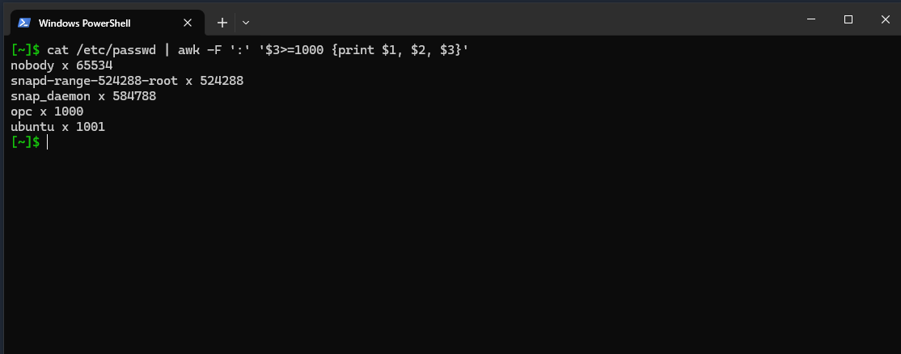
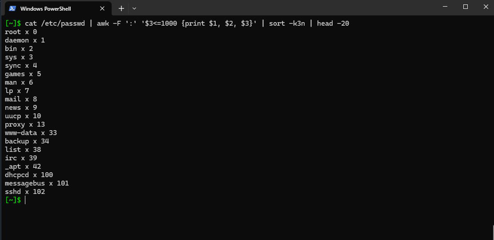
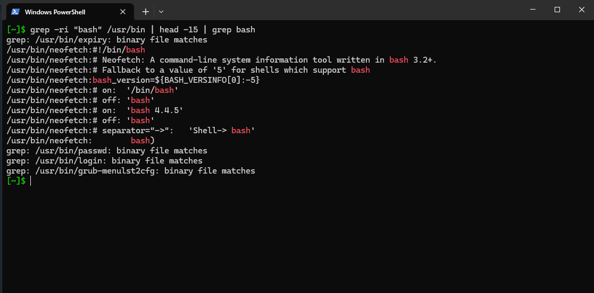
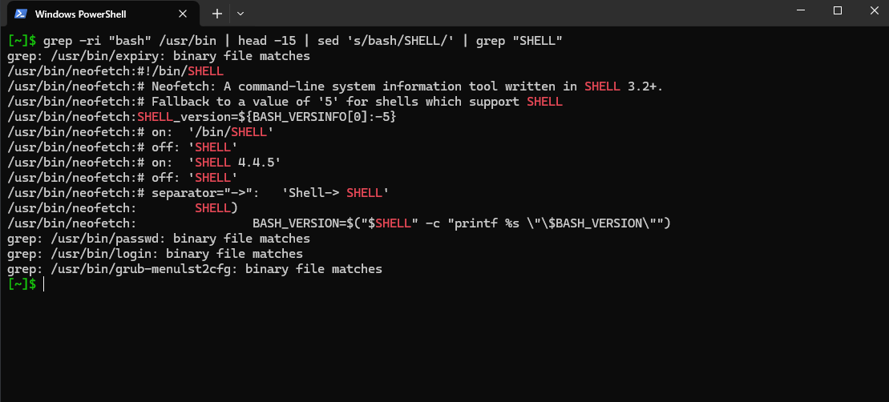
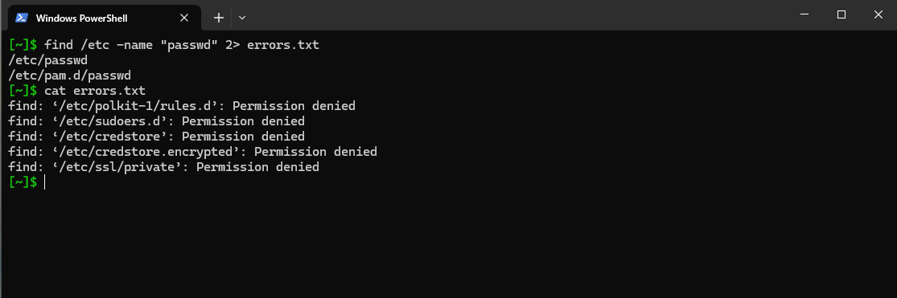
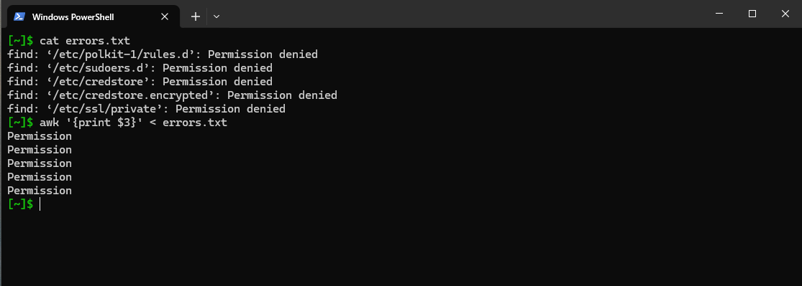
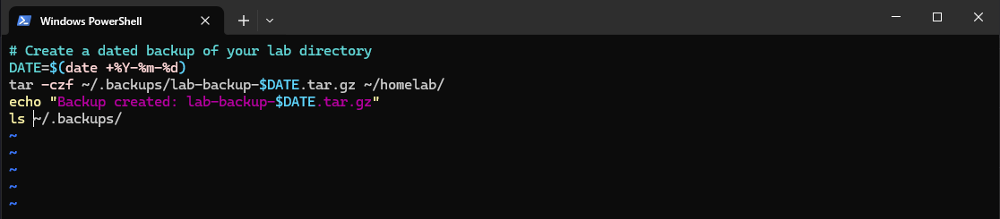
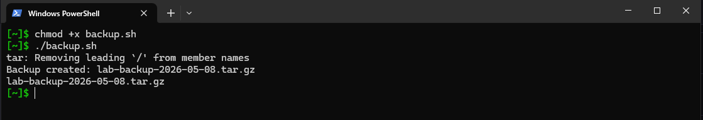

# Processes, Text Processing, I/O Redirection, Archiving

This covers what I practiced on the VPS during week 1. Commands are noted with my own understanding of what they actually do, not just what the man page says.

---

# Processes

These are the core commands for seeing and managing what's running on the system.

- `ps aux` - takes a snapshot of all running processes at that moment, does not refresh
- `top` - live process monitor, refreshes automatically
- `kill` - sends a signal to a process by PID. Common signals: 1 (hangup), 2 (interrupt), 9 (force kill), 15 (graceful terminate)
- `pkill` - like kill but targets by name and also takes out child processes
- `nohup` - runs a process that keeps going even after you log out or lose the SSH connection

---

# Text Processing - grep, awk, sed

## awk

awk reads input line by line and lets you filter and print specific fields. The `-F` flag sets the field separator.



```bash
cat /etc/passwd | awk -F ':' '$3>=1000 {print $1, $2, $3}'
```

This lists users with a UID of 1000 or above, which on Ubuntu means actual human/login users rather than system accounts. The `/etc/passwd` file uses `:` as a separator, so `-F ':'` tells awk to split on that.



```bash
cat /etc/passwd | awk -F ':' '$3<=1000 {print $1, $2, $3}' | sort -k3n | head -20
```

Opposite of the above. This pulls users with UID below 1000 (system accounts), sorts them by the third field numerically (`-k3n`), and limits output to the first 20 lines.

---

## grep

grep searches for patterns inside files or piped input.



```bash
grep -ri "bash" /usr/bin | head -15 | grep bash
```

Searches recursively through `/usr/bin` for anything containing the string "bash". The `-r` flag makes it recursive and `-i` makes it case-insensitive. After piping through `head -15`, grep is used again because `head` strips the color highlighting, so the second grep is just there to re-highlight the matches.

---

## sed

sed is a stream editor, mainly used here to do find-and-replace on output.



```bash
grep -ri "bash" /usr/bin | head -15 | sed 's/bash/SHELL/' | grep "SHELL"
```

Takes the same grep output from above and replaces every occurrence of "bash" with "SHELL". The `s/old/new/` syntax is standard sed substitution. grep is used at the end again to highlight the changed string.

---

# I/O Redirection

Linux lets you redirect where input comes from and where output goes, including errors.



```bash
find /etc -name "passwd" 2> errors.txt
```

Searches for files named "passwd" inside `/etc`. Without sudo, a lot of subdirectories throw "Permission denied" errors. The `2>` redirects stderr (file descriptor 2) into `errors.txt` instead of printing it to the terminal. The actual found files still print normally to stdout.



```bash
awk '{print $3}' < errors.txt
```

Instead of piping, this uses `<` to feed `errors.txt` as input directly into awk. Prints the third field from each line, which in this case is the word "Permission" from each "Permission denied" error.

---

# Archiving

tar is the standard tool for bundling and compressing files on Linux.



```bash
DATE=$(date +%Y-%m-%d)
tar -czf ~/.backups/lab-backup-$DATE.tar.gz ~/homelab
echo "Backup created: lab-backup-$DATE.tar.gz"
ls ~/.backups/
```

This is a small backup script. It captures today's date, creates a compressed archive of the homelab directory named with that date, then confirms it was created. The tar flags used: `-c` creates an archive, `-z` compresses it with gzip, `-f` specifies the output filename.



```bash
chmod +x backup.sh
./backup.sh
```

Made the script executable and ran it. The `tar: Removing leading '/'` message is expected and harmless - tar strips the leading slash from absolute paths so the archive can be extracted anywhere. The script ran and produced the dated archive as expected.
